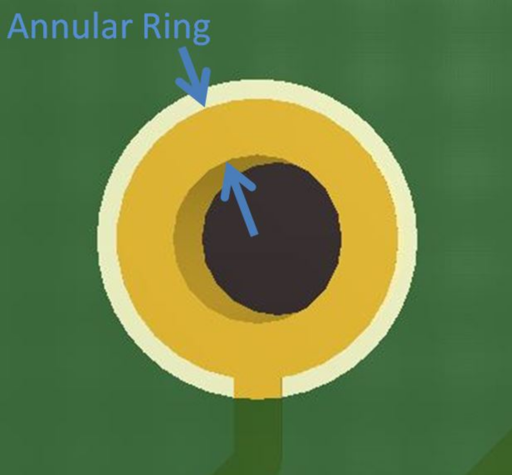
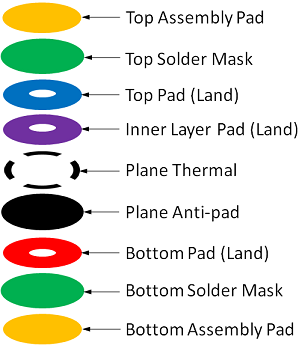

# Glossary
 This is a glossary of terms associated with the design, manufacture, assembly, and test of printed circuit boards (PCBs) and assemblies. The terms in **BOLD** are terms you should look up and become fluent with since they will come up frequently during discussions related to PCBs.

 Please let us know if you have a better definition than the one you see here so we can improve the Glossary.

 

    
Annotation

    noun - the information added to a design that makes refering to things easier
            "I added the Q1 annotation."
    verb - the act of adding information (such as reference designators) to a design
           This can be done via automation or manually. It is often possible to add annotation to either the schematic or the board layout.
           "We annotated all components again to make things sequential."

   
Annular Ring

> An oversized area of copper at the location of a via that ensures proper connectivity for a via, even if it is drilled slightly off center.

> The fabricator will specify a minimum annular ring requirement based on the design technology. Factors that affect the size of the annular ring include the board thickness, number of layers and drill size.

 

 
Antenna

 
> A conductive physical object which can be used to transmit and receive radio waves. 
 

     
 

    
Auto-Routing

> Software capability to automatically route a path between features on a PCB. Depending on what software you're using, this can lead your PCB to look like a "rat's nest." 
 

 

    
Back-Annotation

> The process of updating your schematic based on changes you made to your layout. 
 

 

    
Ball Bonding

> The most common type of wire bonding used to make an electrical connection between a chip and another component on a semiconductor device. A very thin wire (typically a dozen micrometers thick and made of gold or copper) is fed through a capillary tube and brought close to the surface of the chip that needs to be connected. A high-voltage electric charge is applied to the wire to melt its tip. When the wire melts, it forms a ball due to surface tension of the metal. The addition of heat, pressure, and ultrasonic energy cause the ball to weld to the chip. (Image source: Wikipedia)

> 
 

 

    
Bed of Nails Testing

> "Bed of nails" are used to test PCBs and are composed of spring loaded tests pins that mate to different points on the PCB. This allows the electrical connections on the PCB to be verified. 
 

 

    
Bill of Materials (BOM)

> A comprehensive list of all the parts and materials required to make a product. The BOM usually includes part numbers, part descriptions, quantity, manufacturer name, manufacturer part number, price, etc... 
 

 

    
Board Outline

 > The outer contour or board shape of a PCB. 
 

 

    
Bottom

 > The bottom side of the PCB is the side opposite from the top and usually (but not always) does not have any components.
 

 

    
BGA (Ball Grid Array)

 > A ball grid array is a surface-mount packaging used for integrated circuits (ICs). The packaging is composed of a grid like array of solder balls placed on the bottom of an IC to facilitate the connection between the IC and a PCB. Its advantages include having high density, meaning it can be used with ICs with hundreds of pins, having good heat conduction because the grid array allows better heat flow betwen the IC and the PCB, and having lower inductance because the connection between the IC and PCB is very short. (Image source: Electronics Cooling)
>  
 

 
 

    
Bypass Capacitor

 > A capacitor attached in parallel to a power trace (so one port connected to the power line and one port connected to ground) in order to decouple any noise on the power trace. Bypass caps are extremely useful when supplying power to IC's because they help provide a steady, smooth supply voltage. 
 > 
 > 
 > 
 

 

    
CAD

> Computer Aided Design (CAD) tools are software tools used to design products. Common uses of CAD include modeling parts, creating assemblies, running simulations, and making engineering drawings. 
 

 

    
Captive Hardware

> Fasteners designed to be attached permanently, thereby reducing the risk that parts might get loose (e.g. press-fits, thread-locks, etc)
 

 

    
Castellation

> Castellation mounting holes are designed to make it easy to solder one board onto another board, as shown in the image below. (Image source: Sparkfun)
> 
 

 

    
Clock Distribution

> A digital hardware design style which *distributes* a single clock source to **multiple** components. Clock distribution is relevant when multiple components need to share timing (whether that timing is synchronous or not is another design decision). Clock distribution can create problems because various physical factors (varying trace lengths, trace coupling, noise, etc.) can alter the different clock lines in different ways.
 

 

    
Clock Skew

> Phenomenon where signals with the same clock signal arrive at different times. The difference in their arrival time is the skew. 
 

 

    
COB (Chip-on-Board)

> Manufacturing technique where integrated circuits (ICs) are bonded directly to a PCB, eliminating the need for packaging around the IC. 
 

 

    
Conformal Coating

 > A thin polymer film applied to a PCB to protect its electronic components from moisture, dust, and chemicals. 
 

    
Controlled Impedance

> Without intentional design, impedance between two points on a trace is typically "uncontrolled." This is problematic for high frequency applications, and in these instances careful design of the dimensions of a trace and the material properties of the board is required to obtain controlled impedance and repeatable high frequency performance. 
 

 

    
Convection

> Convection occurs when changes in the density of a fluid due to heating or cooling causes motion in the fluid. This mode of heat transfer is a common way to cool electronics. 
 

 

    
Copper

> A highly conductive metal and good thermal conductor commonly used in certain layers of a PCB board to create electrical connections. 
 

    
Coupling

> When the electric field of a trace latches onto an unintended component (e.g. another trace) and induces noise. Better coupling translates to less noise.
 

 

    
DDR Memory Design

> Double Data Rate Memory Design allows for faster rates of data transfer by stricly controlling the timing of clock signals and electrical data. The process doubles the data bandwidth by sending data on both the rising and falling edges of the clock signal. 
 

 

    
Design Rules

 
 > A set of guidelines designed to help engineers create better PCBs. 
 

 

    
DRC (Design Rule Check)

 > A check done via software to ensure that a design does not have any errors (e.g. traces that are too narrow, drill holes that are undersized, traces that should not touch) 
 

 

    
DFM (Design for Manufacturing / Manufacturability)

 
 > A set of guidelines and engineering principles used determine how feasible and efficient manufacturing a part will be. 
 

 

    
DWG file

 
 > A file type that is used to store 2D or 3D designs and commonly used with CAD software. This file type is also commonly accepted by pcb software to import board outlines or other designs.  
 

 

    
Electrical Clearance

 
 > The shortest distance through air between conductive elements. 
 

 

    
Electrical Creepage

 
 > The spacing between conductive elements on a pcb over an insulating surface (e.g. pad-to-pad, pad-to-trace, trace-to-trace, etc..). 
 

 

    
Electrical Test

 
 > Tests designed to verify that a pcb has been manufactured in accordance with its reference design. These tests commonly include a capacitance test to check for opens and shorts and a resistance test.
 

 

    
EMI (Electro-Magnetic Interference)

 
 > A disturbance generated by the electromagnetic field of one source that can disrupt the performance of another circuit. EMI can be either conducted, meaning that it passes through a wire or cable, or radiated, meaning that it wirelessly interferes with another signal. All electronic components generate electromagnetic signals that could potentially interfere with other equipment. 
 

 

    
Fab Drawing

 
 > A drawing used to share information with a manufacturer and provide clear instructions on how the pcb should be manufactured. A fab drawing commonly includes board dimensions, drill sizes, tolerances, material, copper weight, surface finish, controlled impedance requirements, annular ring tolerances, etc... 
 

 

    
Fiducial(s)

 
 > A mark on the top (and bottom if the pcb has 2 layers) copper layer that is used by the vision system of a pick and place machine to recognize where the pcb is. They are often placed as far appart as possible on opposite corners of the board to achieve better precision. (Image Souce: LadyAda)
 >
 >  
 

 

    
Flip Chip

 
 > A method to connect semiconductor devices (IC's or MEMS) to external circuity by use of solder bumps. Solder bumps are deposited onto the device's pads; the pads are on the top side of the device. The device is mounted by flipping the chip so its solder bumps face down and aligning the bumps with the external circuit's pads. Flip chips are a consequence of semiconductor device manufacturing processes. 
 

 

    
Flex PCB

 
 > A PCB printed on flexible material. Using a flex PCB can reduce the weight and size of a project and can make it easier to a fit a board to an existing mechanical design rather than adapting the mechanical design to the PCB. (Image source: Millenium Circuits Limited)
 >
 >    
 

 

    
Flying Probe Testing

 
 > Test to check that the electrical connections on a PCB are correct. During the test, two or more probes contact vias to test for opens, shorts, and component values. This test is commonly used instead of a "bed of nails" test when there is not sufficient access, the bed of nails takes too long or is too expensive to build. (Image Source: KAV Systems Engineering)
 >
 >  
 

 

    
Footprint

 
 > A footprint is the size of the pad(s) and outline associated with a specific component on a pcb.  
 

 

    
Forced Air

 
 > The use of a fan or other device to force air to flow over a pcb in order to cool it. This is important when a pcb is used in a confined environment with an enclosure, where convection cooling and conduction are not sufficient to cool the board down. 
 

 

    
FR-4

 
 > Material commonly used in the core layer of a pcb made of glass-reinforced epoxy laminated sheets. This layer gives the pcb its rigidity and provides electrical isolation between the top and bottom copper layers of a double layer pcb. 'FR' stands for 'fire retardant.' 
 

 

    
FR-408

 
 > A high-performance alternative to FR-4 that is designed for high-frequency or high-reliability applications. It has a low dielectric constant and low dissipation factor. 
 

 

    
GD&T (Geometrical Dimensioning and Tolerancing)

 
 > A set of rules used to define tolerances in an engineering drawing. 
 

 

    
Gerber(s)

 > A binary vector file format for PCB designs used in the manufacturing of PCBs. A gerber file is generated by PCB software such as Altium or KiCAD and is sent to the manufacturer when ordering PCBs. The gerber communicates information such as the number of copper layers, the solder masks, silkscreen, board outline, etc.. 

 

 

    
Glossing

> Glossing is used to improve the routing on a PCB by changing routes to shorten them, reduce the number of corners in a route, change perpendicular corners to diagonal corners, etc...

 

 

    
Grid(s)

 > When laying out components in PCB software, all elements must be snapped to a grid. The user can modify the grid granularity if finer control is needed. 
 >  

 

    
Ground Bounce

 > A phenomenon that occurs when the ground of an IC is different from the board ground. This can happen when there is a surge of current going to ground and inductance in the path connecting the IC to the board ground causes voltage to build up.
 >  

 

    
Heat Spreaders

 > A component used to dissipate heat. Unlike heat sinks, heat spreaders have no fins or fans, but instead have a large surface area connection to a larger surface (e.g. the frame of a vehicle). This allows heat from the PCB to flow to the larger metal surface and dissipate away from the PCB. 
 >
 > In the image below, on the left is a heak sink with a fan, and on the right is a heat spreader. (Image source: ADL Embedded Solutions)
 >
 >  

 

    
Heat Sink

 > A component used to maximize heat dissipation by maximizing surface area (by using fins for example). Heat sinks are often used with cooling fans to use airflow to increase heat dissipation. (Image Source: Arrow Electronics)
 >
 

 

    
Impedance

 > "The effective resistance of an electric circuit or component to alternating current, arising from the combined effects of ohmic resistance and reactance" (Oxford American Dictionary)
 >  

 

    
Imperial

 > A unit of measurement
 >  

 

    
Inner Layer

 > Inner layers are the internal layers of a multilayer PCB. (Image source: Altium)

 

 

    
IPC 356-D Netlist

 > A standard netlist format created by the IPC (Institute for Printed Circuits) that defines test points on a PCB that can be used by a PCB manufacturer to check the board with a test program. 
 >  

 

    
Jitter

 > A periodic signal's deviation in time from its nominal value, often due to electromagnetic interference or crosstalk. 
 >  

 

    
JTAG (Joint Test Action Group)

 > JTAG is a hardware interface used to verify the physical connections on a board after it has been manufactured. It was created in 1985 after the emergence of ball grid array technology that made it difficult to use probes to check a PCB. 
 >  

 

    
Keepout

 > An area on a PCB that should be kept free of components or traces. Scenarios in which a keepout area might be required include making room for a connector, the motion of a switch, or a mechanical enclosure near the PCB.
 >  

 

    
Layer(s)

 > PCBs are composed of a stack of layers with different materials and purposes. Thes include the silkscreen, the soldermask, copper layers, substrate (typically FR4).  Although there are many different kinds of layers in a PCB, when referring to the number of layers in a PCB, only the copper layers are counted. (Image source: Sparkfun)

 
 

 

    
Metric

 > A unit of measurement. 
 >  

 

    
MBO (Mechanical Board Outline)

 > A contour line defining the physical shape of a PCB. 
 >  

 

    
Microphonic(s)

 > Microphonics is the sound that is generated from electronic devices as the result of mechanical vibrations. 
 >  

 

    
micro-vias

 > Microvias are vias with a diameter smaller than 150 micrometers and manufactured using lasers. They are used to reduce the size of a PCB. 
 >  

 

    
MicroStrip

 > Microstrip routing is a method of routing a high speed transmission line on a PCB where the transmission line trace is placed on an external layer of the board such that it's separated from a ground plane by a dielectric material. (Image source: Optimum Design Associates)

 

 
Mil(s)

> 1 mil = 0.001 in. Talking in terms of mils makes conversation easier since many PCB elements are small.

 

    
Mounting Holes

 > Holes on a PCB used to secure the board to another component, such as an enclosure or flat surface. Mounting holes can be supported, meaning that they are plated and usually tied to the ground plane, or unsupported. 
 >  

 

    
Mouse Bites

> Breakaway tabs used to separate boards from panels. Weak spots are introduced in the board by using a cluster of drills hits. These weak spots make it easy to break off the board from the panel. Visible "mouse bites" or nubs are left behind on the PCB after the PCB is broken off from the panel. Alternative to V-scoring.

 

    
Node

 
 > A connection between two or more terminals of a circuit component.
 

 

    
Netlist

 
 > A description of the connectivity of a circuit. A netlist is a list of electrical components and the nodes which connect them.
 

 

    
Ounces of Cu (Oz of Cu)

> A specification of <strong>copper weight</strong> needed for circuit traces. Copper weight is the weight *in ounces* of copper present in one square foot of area. Ounces of Cu therefore indicate the thickness of copper in a circuit board layer.
 

 

    
Pad(s)

> Exposed metal on the surface of a board that is used to solder a component to. The most common pads are plated through-hole pads (PTH) and surface mount device (SMD) pads. 
 

 

    
Padstack

> Padstack refers to the geometry and composition of a pad. Surface mount padstacks are different than plated through-hole padstacks. Consider the plated through-hole padstack: 
 
 

 

    
Panelization

> The PCB manufacturing strategy to process *multiple* PCBs on a single panel. A panel can either have duplicates of a single design or have multiple designs on it. This method allows for easier copper pouring and mounting of components. Eventually, the panel is broken into individual PCBs.
 

 

    
PDN (Power Distribution Network)

> A Power Distribution Network is the implementation of delivering current and voltage to components in a PCB. PDNs must take into account different power supply voltages and a PCBs physical design.
 

 

    
Phototools

> A phototool is the [negative](https://en.wikipedia.org/wiki/Negative_(photography)) image of the copper circuitry. Phototools are typically made from photo emulsions. 
 

 

    
Piezoelectricity

> The electric charge which accumulates in (certain) solid materials due to applied mechanical stress (pressure and latent heat).
 

 

    
Pin 1

 
 > Pin 1 can refer to an IC package's pin in order to prove a positional reference. Pin 1 is often denoted by a bump or special notch on an IC's package.
 

 

    
Placement

 
 > Placement is the stage of PCB manufacturing when components are fixed to a board. Placement can be done manually or by [pick-and-place machines](https://en.wikipedia.org/wiki/Pick-and-place_machine).
 

 

    
Plane(s)

 > A continuous area of copper on a PCB. 
 

 

    
Potting

 
> The process of filling an electronic component with a solid or gelatinous compound. Potting protects electronic assemblies against corona discharge, vibrations, and moisture or corosive agents.
 

 

    
Pour(s)

 
> A pour is the filling of an area on a PCB with copper.
 

 

    
QFN (Quad Flat No-leads)

 
> A type of IC packaging which connects an IC to a PCB via surface-mount technology. 

 

 

    
Ratsnest (Airwires)

 
 > A feature of PCB CAD softwares which indicate the direct path between two components. They do not represent physical connections. The ratsnest can help visualize congestion of parts and traces.
 

 

    
Real Estate

 
 > Space on a PCB.
 

 

    
Rework

 
 > Refinishing or repair of a PCB. Rework often includes desoldering and re-soldering of surface-mount devices.
 

 

    
Rigid - Flex

 
 > A type of PCB which is rigid at some points of the board and flexible at others.
 

 

    
Routing

 
 > The step in PCB design in which electrical components are electrically connected. Connections are made by traces and vias.
 

 

    
Schematic

 
 > A circuit diagram. Symbols on a schematic represent circuit components while wires represent their connections.
 

 

    
Schematic Capture

 
 > The step in PCB design in which the schematic(s) are created.
 

 

    
Scripting

 
 > The concept of writing scripts to automate the PCB design process.
 

 
 

    
Silkscreen

> The silkscreen consists of the letters and symbols visible on a PCB that make it easier to identify where things are. The silkscreen is usually white, as shown in the image below. 

 

(Image Souce: Sparkfun)

 

 

    
SMT (Surface Mount Technology)

 
 > The method of directly mounting components onto the surface of a PCB.
 

 

    
SMD (Surface Mount Device)

 
 > Electrical components which are mounted by SMT.
 

 
 

    
Soldermask

> A protective coating over a copper layer to prevent short circuits, corrosion, and other issues. The soldermask is usually green, but other colors are possible. 

 

 

    
Stackup

 
> The arrangement of layers that make up a PCB.
 

 

    
Stencil

 
> A thin metal sheet with a circuit pattern cut into it in order to match the pattern of SMDs on a PCB. Stencils are used when applying solder paste onto pads.
 

 

    
Stiffeners

 
> Materials added to a flex or rigid-flex PCB in order to rigidize a particular area.
 

 

    
Stripline

 
> A transmission line which is surrounded by dielectric material and suspended between to ground planes.
 

 

    
Surface Finish

 
 > A coating between a component and its bare PCB. Surface finishes ensure solderability and protect exposed copper. Some types of surface finish are: Hot air solder leveling (HASL) and lead-free HASL, OSP, Immersion Tin, Immersion Silver, and Electroless Nickel Immersion (ENIG).
 

 

    
Symbol

 
 > The graphic which represents an electrical component.
 

 

    
Tab Routing

> An approach to panelization that uses tabs to separate the individual PCBs. Tab routing allows for non-rectangular board shapes, but also takes more time to set up and wastes more material. Alternative to V-scoring. PROOFREAD

 

 

    
TAG-Connect

 
> A brand of connector that mates to PCBs for connecting debuggers, programmer, or test equipment. Alternative to JTAG; unlike JTAG, Tag-Connect doesn't require a separate mating component on the PCB and has a much smaller footprint. PROOFREAD

 

 

    
Termination

> The practice of placing a device at the end of a transmission line which matches that line's characteristic impedance. Proper termination cancels a signal's reflections in the transmisison line. Improper termination, or not terminating your lines, will cause distortion of the signal.
 

 
 

    
Thermal / Thermal Relief

> A small trace used to connect a pad to a plane and provide thermal relief. If the pad was directly connected to a plane then it would be very difficult to heat up the pad to a high enough temperature to make a solder joint because of the thermal mass of the plane. Using a small trace instead reduces heat flow and makes it easier to solder. 

 

 

    
Thermal vias

> Vias placed directly below or very close to PCB components that need heat dissipation.

 

 

    
Thieving

> Copper (often in the form of dots, grid, or solid fill) added to the outer layer of a PCB to ensure a uniform distribution of copper plating on the features of the PCB. The "thieving steals" plating current from concentrating on sparse features and instead spreads it out over areas with many features. This also reduces the amount of copper that needs to be etched away, leading to more even etching times across the board. It's also used to even out the thermal properties of a board to prevent twist and warp during the thermal cycling that occurs in the reflow process. (Image source: https://resources.altium.com/pcb-design-blog/printed-circuit-fabrication-for-the-pcb-designer) 

 

 

    
THT (Through Hole Technology)

> The mounting scheme for electronic components that uses leads inserted through holes in the PCB. As opposed to SMT (surface mount technology).

 

 

    
Tooling

 
> Tooling encompasses the one-time steps needed before board manufacturing for creating stencils and fixtures, programming drill movements, etc. PROOFREAD

 

 

    
Tooling Holes, Tooling Strips/Tooling Frames

> Tooling holes are placed on a PCB to temporarily align and hold it down during manufacturing, assembly, or test. The tooling holes are often on a tooling strip/frame to make it easier for machines to hold the PCB.

 

 

    
Top

 
 > The top layer of a PCB. The Top can also be called the component side. The Top side is usually where components are placed. Using "Top" is preferrable because components can be placed on both sides of a circuit board.
 

 
 

    
Trace(s)

> A continuous path of copper used to make electrical connections on a PCB. As shown in the image below, the trace is the area between the two dark lines coming out of the RES pin and 5V pins. Traces vary in width depending on what current they are carrying. In this case, the RES pin has a narrower trace than the 5V trace. (Image source: Sparkfun)

 

 

    
Track(s)

 
A synonym for trace(s).

 

 

    
Transmission Line

> A set of conductors that connects a signal between its source and destination. There are three common types of transmission lines: microstrips (left), striplines (middle), or coplanar waveguides (right). For each type, we can calculate the characteristic impedance and electrical length to analyze circuit performance. Each type is defined by their specific geometry and consequently their electrical coupling. Microstrips are signal traces which have a dielectric layer beneath them (and ideally a ground plane beneath the dielectric) and have their top side exposed to air. Microstrips are used on the top and bottom sides of a PCB. Striplines are like microstrips, but have a dielectric layer above and below the trace (and ideally a ground plane above the top dielectric and one below the bottom dielectric). Striplines are used in the inner layers of a PCB. Coplanar waveguides are like microstrips, but ground traces run parallel to the signal trace. The ground traces provide the signal trace with better coupling. Coplanar waveguides can appear on the top and bottom of PCBs.

 

 

    
Triboelectricity

> The triboelectric effect is when materials become electrically charged through contact (ex. rubbing). PROOFREAD (not sure how this relates to PCBs?)

> 

 

 

    
TSOP

 > TSOP (thin small outline package) is a type of surface mount IC package. They have leads on only two sides of the IC and have very tight lead spacing. PROOFREAD

 

 

    
Ultrasonic Bonding

 
> A process in which two workpieces are bonded by the pressure of high-frequency ultrasonic sound waves. Generally used for thermoplastics and thin metals. For electronics, ultrasonic welding can be used to make small electrical connections (ex. wire bonding). PROOFREAD

 

 

    
Via(s)

> A hole in a PCB that allows current to pass from one layer to another. Vias can either be tented, meaning that they are covered by the soldermask so nothing can be soldered to them, or untented, meaning that we can solder a component to it. 

 

 

    
Via Stitching

> A PCB design technique to tie together large copper areas. Stitching vias can be used to join ground planes on different layers to lower return path impedance. Stitching vias are important in RF design; they can be placed around an RF trace to EM interference with other components on the board. PROOFREAD AND TODO (b/c i don't actually understand)

 

 

    
V-Scoring

> A method of cutting a V-shaped groove into PCBs to split them. This is useful when you want to leave a set of PCBs grouped for easier assembly but want to separate them afterwards. Alternative to mouse bites.

 

 

    
Wire Bonding

> A method to make an electric connection between an integrated circuit and chips. Different types of wire bonding include ball bonding and wedge bonding. Here is a [video](https://www.youtube.com/watch?v=fazeH4PHvpk) that shows both methods of wire bonding.

 

 

    
Wedge Bonding

> Unlike ball bonding, wedge bonding requires the wire to be in a specific direction during bonding, so it's a slower process than ball bonding due to the extra time needed for tool alignment. However, the lack of the ball means wedge bonds can be used in finer pitch applications (PROOFREAD). Wedge bonding can use a larger diameter wire than ball bonding. 

 

 

 
