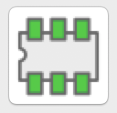
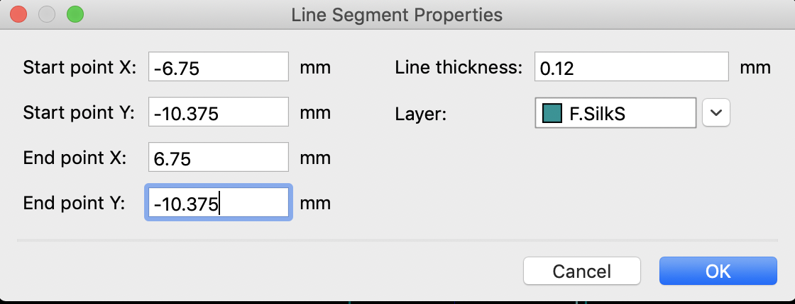
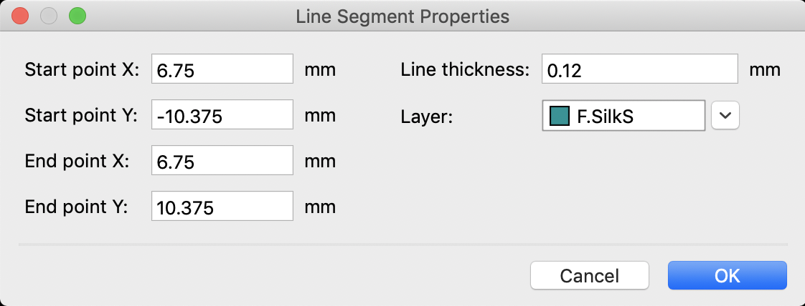
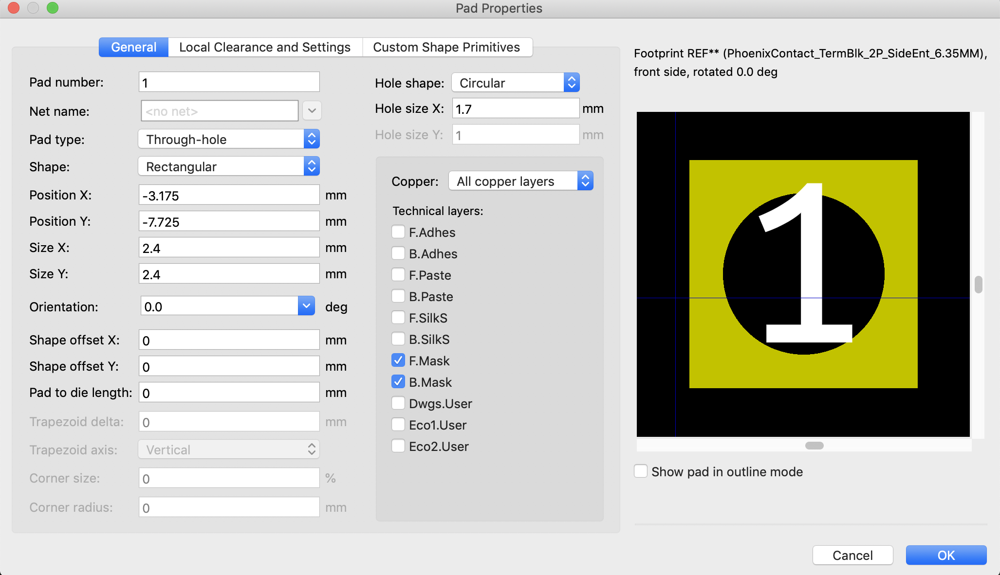
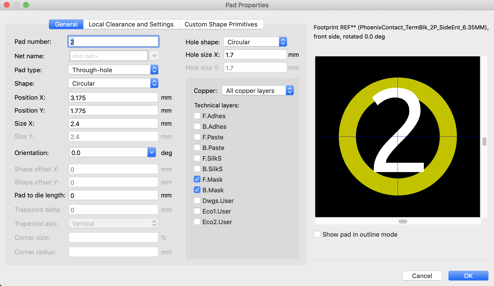
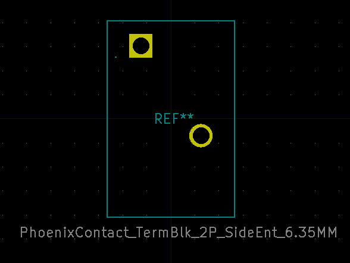
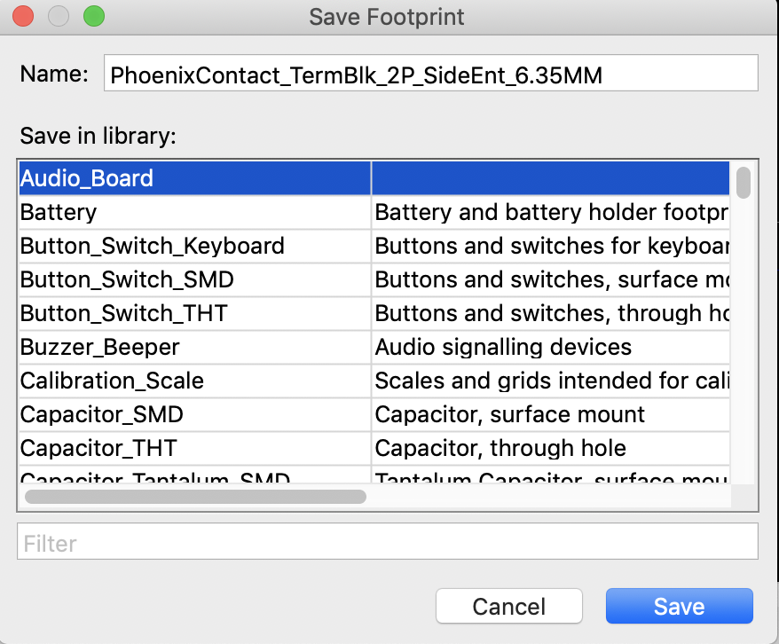
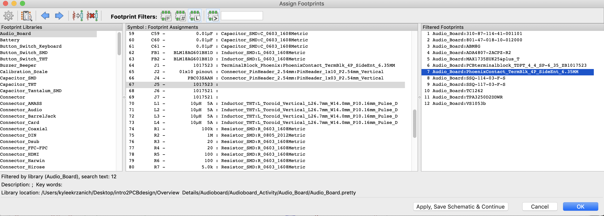

## Audioboard Activity Summary

Open the audio_board.pro file in the Audio_Board folder. Then click on the schematic layout editor to view what the audio board will look like.

## Finish the Schematic

TODO 

<!--
## Add commonly used libraries to your KiCAD libraries
* Follow these instructions to import the Digi-Key KiCad Library: https://forum.digikey.com/t/importing-the-digi-key-kicad-library-into-kicad-5-0-0/4075
-->

## Add Footprints

Open the schematic. 

Select "Tools - Assign Footprints"

Note that there are a couple of symbols that don't have footprints yet (J5/6/7 are blank!). Unfortunately there are no native Kicad footprints for Phoenix contacts so we will make our own. It's very common to find parts that you want to put on your PCB but most parts don't have premade footprints so you'll get really good at reading datasheets. We already made the 4-pin version for you but keep reading to learn how to make the 2-pin version. 

In order to make the footprint, we need to look at the datasheet to get the sizing right. Above is an image from the datasheet for the 2-pin phoenix pins. We will use it throughtout this tutorial so take a good look. 

Now, to start open the footprint editor using this button: 

Next click file -> new footprint. It will prompt you for a name and you should put something appropriate, for example "PhoenixContact_TermBlk_2P_SideEnt_6.35MM". Next click on each of the two labels that appear in the center of the screen and type m. Now you can move your cursor to move them around and then click to place them out of the way. 

Okay now to start the footprint we can look at the image above and plan it out. Because we want it to be centered on the origin, we will make the vertical part (labeled 20.75mm) go from -10.375 to 10.375 and then the horizontal part (labeled 13.5mm) will go from -6.75 to 6.75. To start click on the graphic line button and then click on each edge to create a box and finally double click to end. This is just a rough sketch but once youre done click on the arrow button again. Now click on the top line and press e to edit. Now we will define the top line as follows:

Next, lets do the right side using the following dimensions:

Try finishing the rest of the dimensions on your own and leave a comment on piazza if you have any trouble.

Now we have to add the holes. Click on the 'add pad' button (below the arrow) before place the first hole in the upper left corner and then the second button in the bottom right (look at schematic for reference). Now use the arrow button again, hover over the first hole, and click e. Put the following settings in: 

Now do the second hole like this:

Your footprint should now look something like this: 

Now save the footprint to the Audio Board library: 

CONGRATS!!! You've finished your first footprint. You should be extremely proud. 

## Assigning Footprints
If you followed the previous instructions correctly you should now be able to go file -> assign footprints. The first phoenix contact is a four-pin and then the other two are two-pin contacts. Double click using the selections below to add:

Finally hit "apply save schematic and continue" to finalize the selections.

## Layout the footprints

Save the schematic and go tools -> Update PCB from schematic to add the footprints you selected in the previous step to the board layout. 

You should see many white lines connecting the footprints. These are known as net lines and correspond to the electrical connections outlined in your schematic. You now need to strategically arrange the footprints such that you'll be able to add the necessary routes to connect all of the footprints together as dictated by the net lines. **Remember that you should aim to spend 90% of your time creating your footprint layout and only 10% of your time adding traces after you're done the layout.** If you add traces too early, it will be difficult to fix mistakes in your footprint layout. Note that the way components are laid out in a schematic is not always the best way to layout the components on a board. 

When arranging the footprints, here are some things to think about: 

- What size should the board be? 

- Where do you want the connectors to be? 

- How far apart do you want the speakers to avoid crosstalk? 

#### Strategy to layout footprints

Select a pin on a footprint in your pcbnew file and press ~. All of the pins connected to this pin will be highlited. Try doing this for all of the voltage pins (+36V, +12V, +3.3V, +2.5V, +1.8V, GND). If many footprints are connected a specific voltage, consider making a separate plane for that voltage (e.g. ground) and connecting every pin linked to that voltage to the plane through a via. If a few components are connected to a specific voltage, consider arranging them into their own subgroup. Select the optimal layout for the footprints within these subgroups. 

Open both the schematic and pcbnew file at the same time. Select a component on the schematic and notice that its corresponding footprint is highlighted on the pcbnew file. Start making subgroups of footprints by grouping larger components like U1, U2, U3 with their corresponding resistors and capacitors. Select the optimal layout for the footprints within these subgroups.

Some useful commands 

- Hover over a footprint and press R to rotate
- Press X to draw a trace 

Note: aim to get your footprint layout done for this week. We'll critique each other's layout on Wednesday and do the tracing afterwards. 

## Notes from the previous week (we've done these steps for you!) 
This week we are getting ready to layout the Audio Board block. In our weekly activity session Max showed us how to do several things:
1. How to look at the documentation for a part, in this case the Texas Instruments TPA3250 High-Performance Class-D Power Amplifier.
2. How to look through the documentation and find the "eval board" information which gives us a huge head start.
3. How to search for part footprints and install those in the libraries.
4. How to convert a design in Eagle into a KiCAD project by going through the process with the Adafruit VS1053 CODEC Breakout PCB.

### Finding Footprints
Max shared his methodology for finding part footprints. To find part footprints that aren't already in your KiCAD fotprint library he uses the resources below in the order listed:

1.  https://componentsearchengine.com/EXB-18V103JX/Panasonic
2.  https://www.ultralibrarian.com/ {this is a Windows thing, so us Mac folks are outta luck}
3.  https://www.snapeda.com/
4.  https://kcdb.ciphersink.net/
5.  For TI parts: https://webench.ti.com/cad/
6.  Digikey KiCad library: https://www.digikey.com/en/resources/design-tools/kicad
7.  Built-in KiCad libraries are great (and so is the footprint generator)
8.  Importing reference designs and reusing their footprints
9.  If all else fails… google: part number + “footprint” | “PCB” | “component” | “symbol”
10. If you really can't find the correct footprint, try to find a similar component and modify that footprint as required.
11. If you are REALLY stuck you can generate one from scratch* (YIKES!).

 * Yes, we can show you how to do this, but it is time consuming, requires great attention to detail and demands double checking, etc. 

We will put more detailed information on each of these steps here as time permits.

