# Display board

On the front of your UberRadio, there will be a touchscreen LCD display to control the radio's functionality. The display board you are making will house the touchscreen display and its controller.

## BEFORE GIT PULLING, PLEASE READ THIS:
(If you have not made your display symbol from part 1 of the activity, you can skip this step.)

We are adding new symbols to the Display_Board library for the rest of the schematic, but we don’t want to overwrite the hard work you put into your display symbol! Here is how we can preserve your work:

**BEFORE GIT PULLING:** 

- Find Display_Board.lib and rename it to Display.lib. This way it won’t get overwritten when you git pull.
Delete the sym-lib-table file.
- Git pull. If there are conflicts, make sure they will not overwrite Display.lib. Send us a note on Piazza if you are unsure.
Open Root.pro. You should see a Display_Board_2.lib and a Display.lib. 
- Let’s double check that our library paths are now correctly linked. Go to Preferences > Manage Symbol Libraries…, and click on the Project Specific Libraries tab. You should see that Display_Board points to Display.lib (which has your custom symbol) and Display_Board_2 points to Display_Board_2.lib, which are the new symbols.

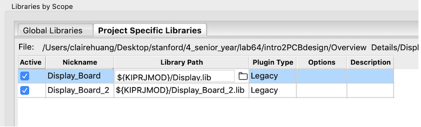

## Step 1: Make the LCD display symbol
We are using this [2.8" display with resistive touchscreen](https://www.adafruit.com/product/1774). 

Here is its [datasheet](https://cdn-shop.adafruit.com/datasheets/MI0283QT-11+V1.1.PDF). Page 10 has an annotated listing of all 50 pins, which you will need to add to your symbol. 

Note that the table has an I/O column, which will help you assign the "Electrical type" of each pin. 
- I = Input
- O = Output or Power output (if ground)
- IO = Bidirectional
- P = Power input
- G = Power input
PIn 50's I/O value is not provided -- you can make it a Power output.

## Step 2: Hierarchical schematics
As your projects grow in size and complexity you will probably want to abstract away different portions of your system; hierarchical schematics are one strategy for abstraction in your schematic designs. For the display board schematic, since the display symbol is quite large, we can move it to its own child sheet to keep the rest of the schematic readable.

Open Root.pro.  In the project that opens, you should see a Root.sch (houses all symbols except for the display) and a Display_Board.sch (houses the display symbol you've made). You will modify Root.sch to have Display_Board.sch as its hierarchical child sheet.

We will explain how to generally set up hierarchical schematics. Starting with whatever your schematic is now (here’s mine):

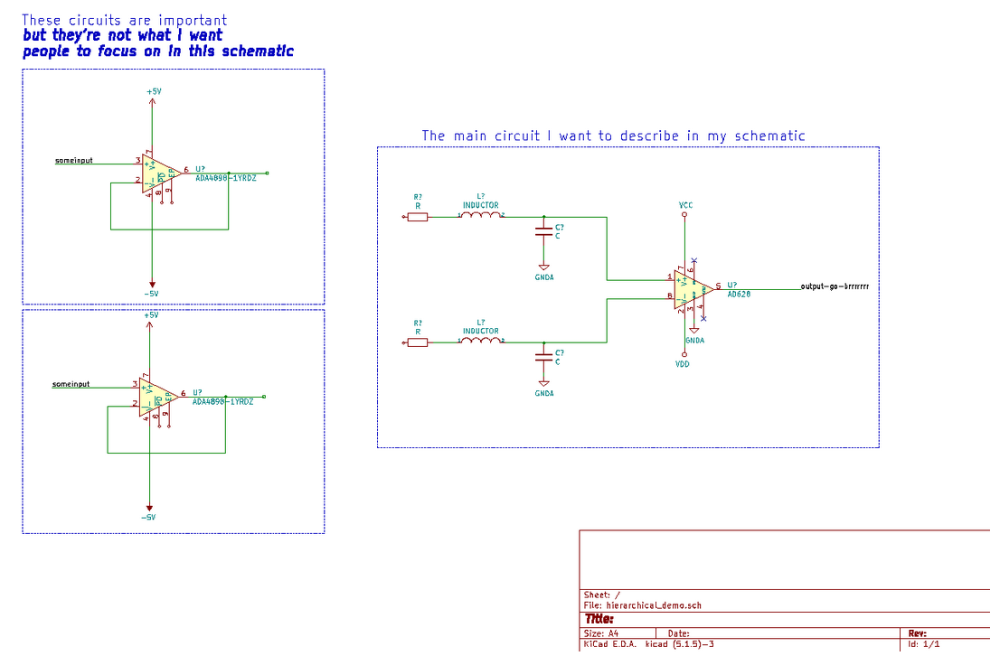

Identify what circuitry you would like to emphasize in your schematic. In my case it is the box on the right. I want to hide the circuitry on the left, but I still want the circuitry to exist and contribute to the eventual layout of this circuit. To abstract away the “detail” on the left I will hide each box in its own hierarchical schematic. To create a hierarchical schematic, locate this button in KiCad:

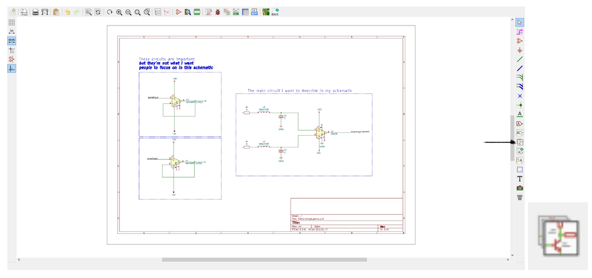

You’ve found the right button if, when hovering over the button, it says “Create hierarchical sheet”. Click this button and then make a rectangle on your schematic by clicking four times. Once you’ve done the fourth click you should see a menu pop up like this:

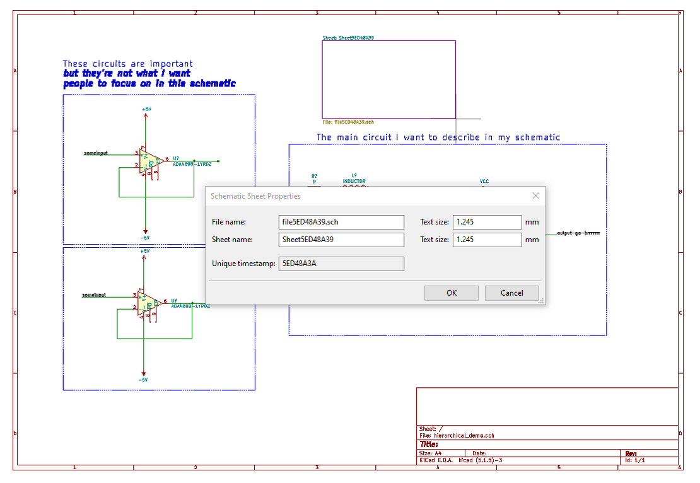

What making a hierarchical schematic in KiCad does is that it adds a new schematic to your KiCad project. There are two ways to refer to this new schematic:
* **File name** dictates the name of the new schematic file, which you will see in your KiCad project file directory.
* **Sheet name** dictates what you as the designer are calling your child schematic.
As you can see, these names do not need to be the same:

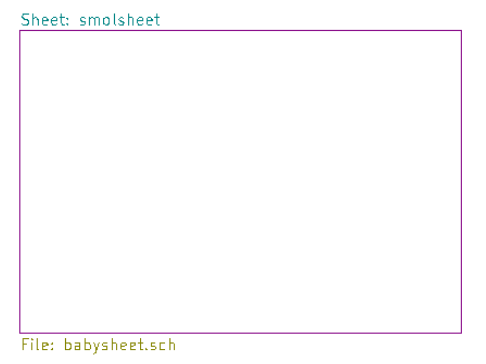

My KiCad project now acknowledges that I have two schematics:

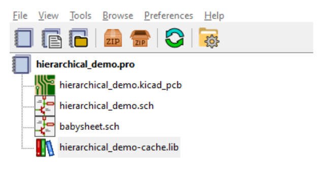

Now that we have created a hierarchical sheet we can populate it. There are two ways of populating a hierarchical schematic using KiCad.

### Method 1: Copy and Paste

Select and copy the circuitry you would like to put into the child schematic into your clipboard and enter the child schematic by double clicking on the sheet or by right-clicking the sheet and then clicking “Enter sheet”. Now paste and place your circuit into the sub-schematic!

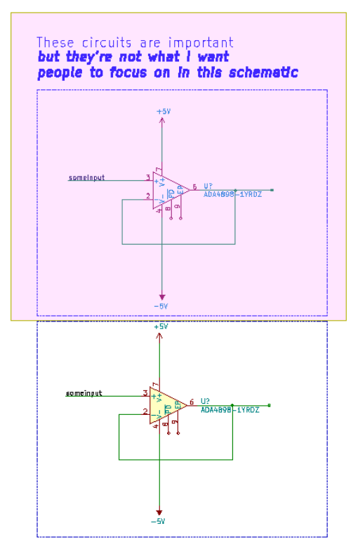

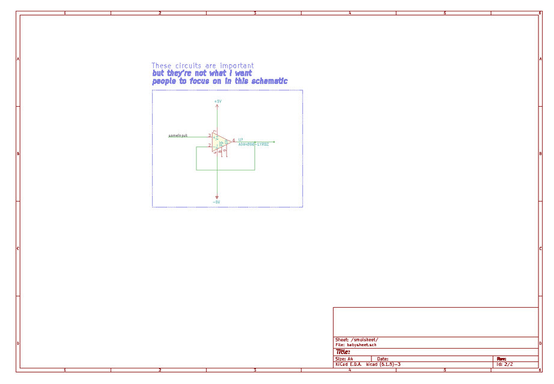

### Method 2: Append Schematic Sheet Content

The other way to populate your subsheets is to append to it from an already existing schematic sheet. To do this you would enter your subsheet and then click on File -> Append Schematic Sheet Content. Then find the schematic you would like to add into your subsheet

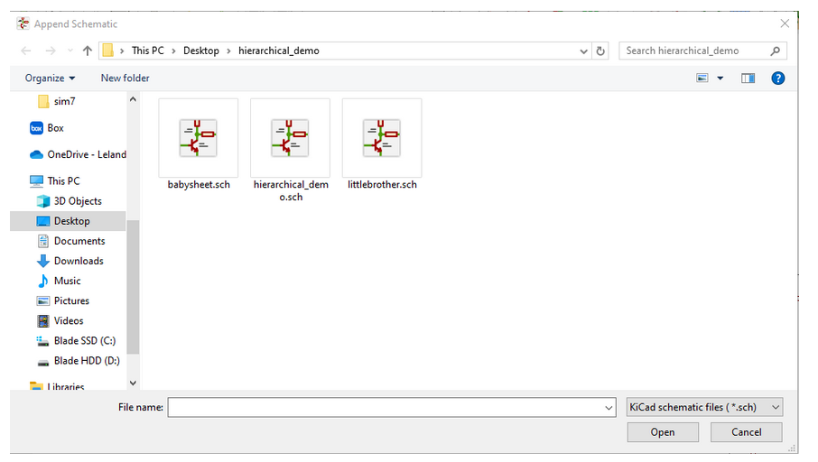

I’ll pick littlebrother.sch. Once you hit “Open” and select how you want KiCad to refer to the location of this schematic (relative or absolute), your subsheet will now exactly reflect the schematic you imported from. In other words, all existing work on your subsheet will be erased and replaced by the schematic you append from.
 
 
After either method, notice that the schematic information in the bottom right corner of the schematic reflects that we are in our subsheet:

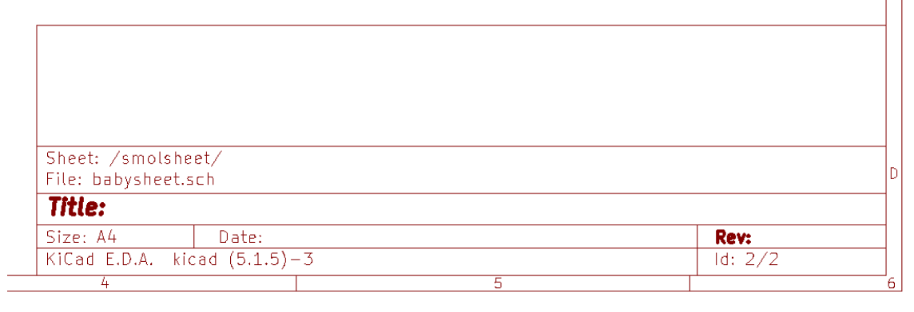

To move from this subsheet to the sheet above you can either right click and hit “Leave Sheet” or click this button 

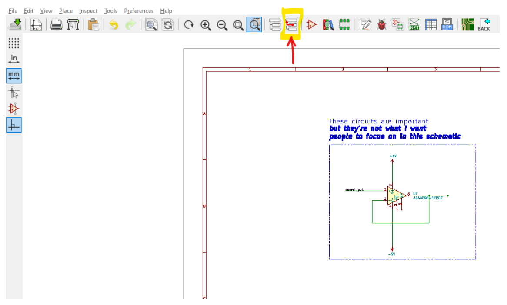

If you click the button to the left of the highlighted button above then you can navigate to any sheet in your project!

After moving all desired circuitry into their hierarchical schematics my root schematic looks like this:

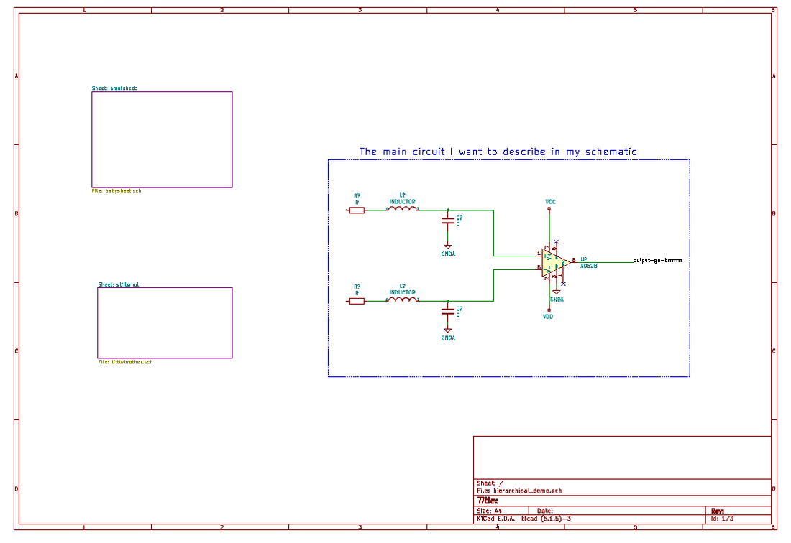

Now the circuit I want to focus on is clearly the focus of this schematic! We now need to make all relevant pins within our sub-sheets available to the sheet above it. There are two ways of doing this:

* **Global Labels**  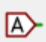
Global labels are visible everywhere in the schematic. A consequence of this global visibility is that any global labels with the same name will be connected in the eyes of the schematic. In other words the netlist that is generated from your schematic will show a connection between those two global labels, which might have nothing to do with each other. 

* **Hierarchical Labels**  Hierarchical labels must be assigned within the subsheet and exposed to the parent sheet. The visibility of a hierarchical label is between the subsheet and the parent sheet. 

To make a connection to a hierarchical label we must first add one. Find the icon for the hierarchical label, decide on an appropriate name, and label a wire like you have before. The result of these actions should look something like this:

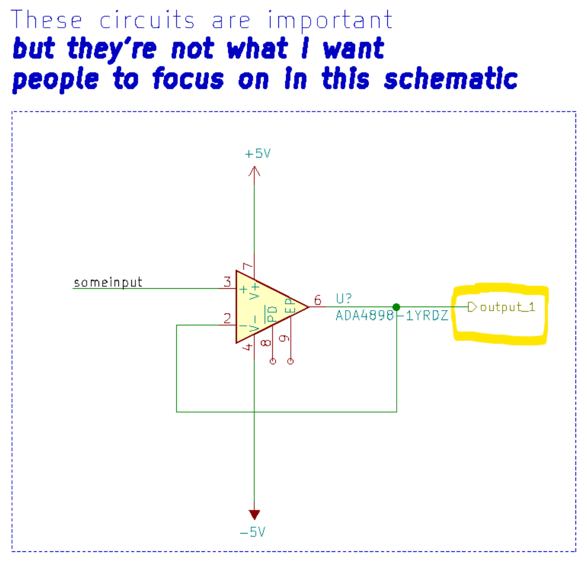

The hierarchical label has been assigned within the subsheet. To make this label visible to the parent sheet,locate this button 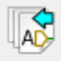. When you hover over this button you should read “Place hierarchical pin imported from the corresponding hierarchical label”. Click the button and then click inside of the box of your subsheet. You should see a new pin with the name you assigned to the hierarchical label:

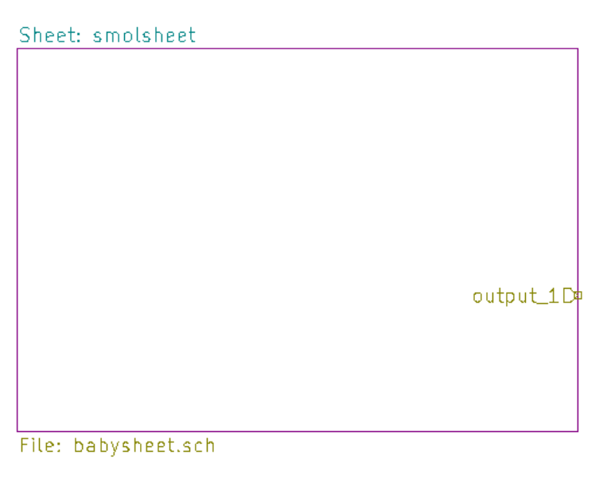

You can now connect these hierarchical pins to the rest of your schematic:

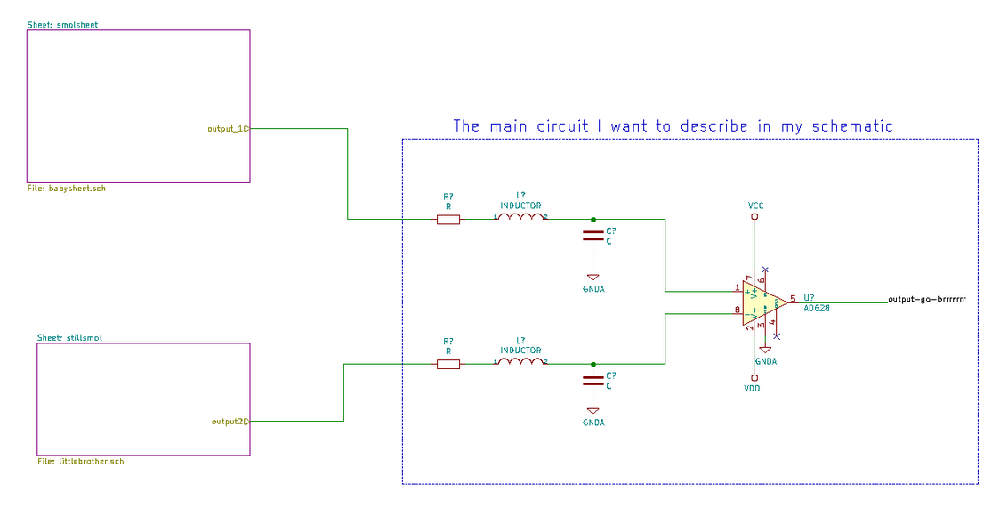

Now there exists a connection between some circuit inside of a subsheet and the root sheet of the hierarchical schematic. Notice how the schematic looks much cleaner!

## Step 3: Finish the schematic

### Add connections to your display
In Display_Board.sch, connect the pins on your display symbol as follows. Note that the pins in this screenshot have local labels, but you should use either **hierarchical or global labels** for all pins.

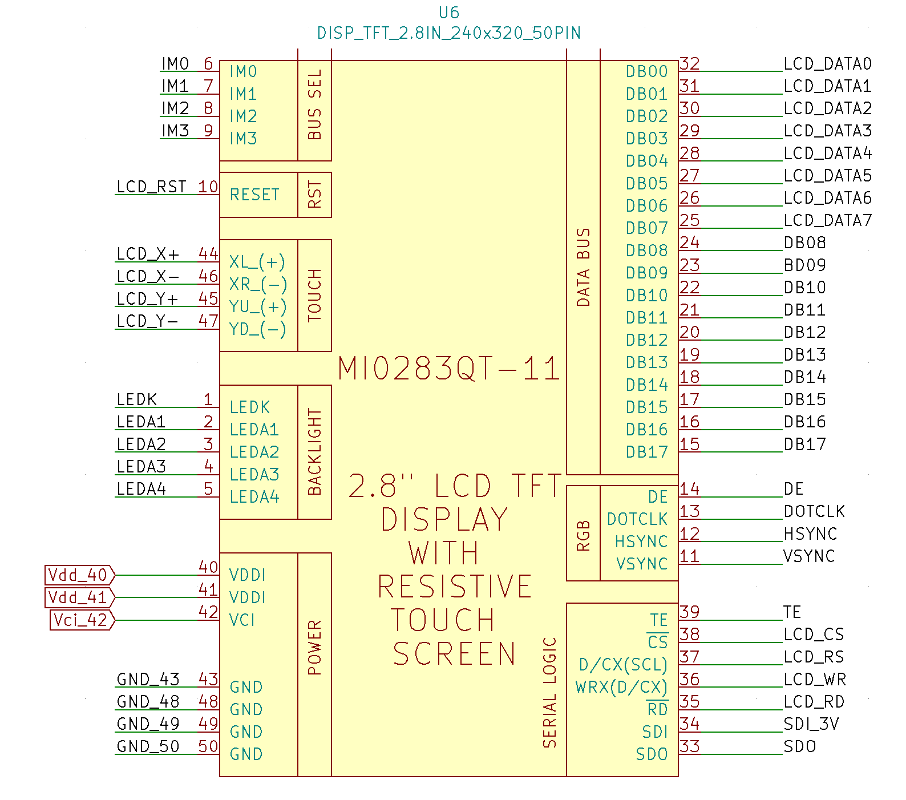

Delete the 50 pin connector from Display_Board.sch.

### Add display connections to your root schematic
We now need to connect the pins from your child schematic into your parent Root.sch sheet. 

**If you used hierarchical labels:** Using the "Place hierarchical pin" button mentioned in step 2, click in the hierarchical Display_Board schematic box. The hierarchical pins you made in the child sheet should appear one by one as you click. Connect them to the local pins of the same name. Here is a partially completed version for reference:

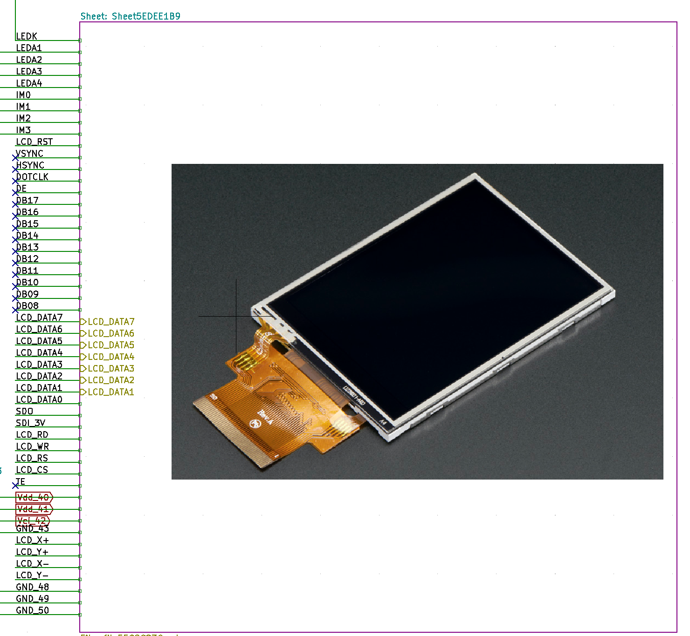

**If you used global labels:** Add global labels to each of the 50 pins. Here is a partially completed version for reference:

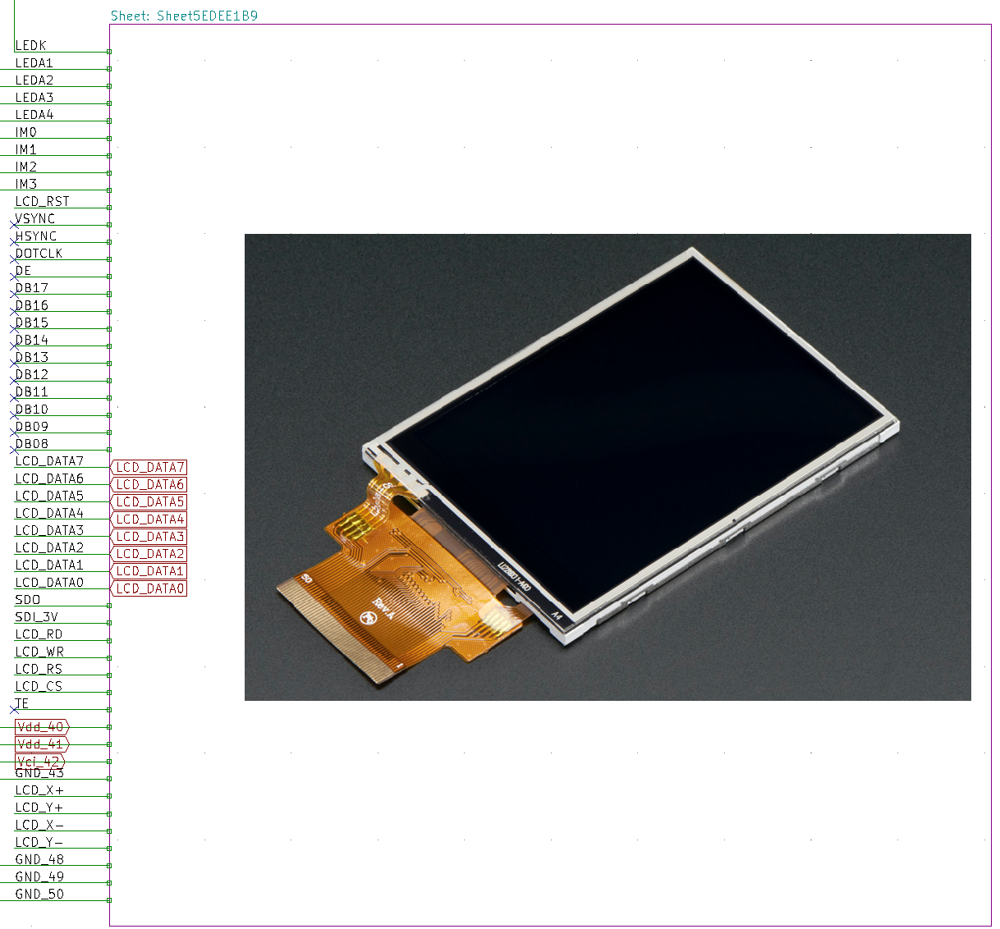

### Add mounting holes and fiducials
In Root.sch, add four mounting holes and two or three fiducials to your schematic.

### Add footprints
Import the Display_Board.pretty footprint library.

All footprints on the root schematic should be assigned. 
* Assign the display symbol you made to the Display_Board:TFT_2.83IN_240X320_50PIN footprint.
* Assign the mounting holes to the mounting hole footprint found in the display board library
* Assign the fiducials to the Fiducial_0.5mm_Mask1mm footprint.

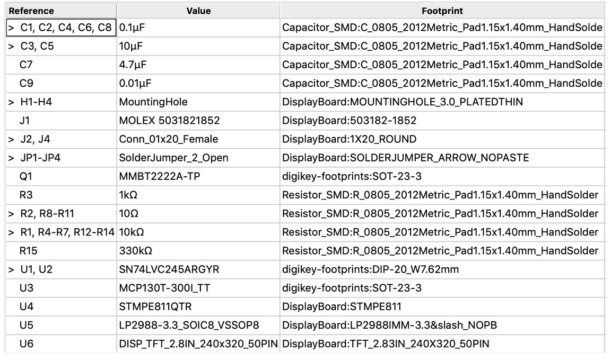

## Step 4: Layout the board 

* Import the board outline called DisplayBoardOutline.dxf in the activity repo folder 
* Use the displayboard_hole_layout.py script to position the mounting holes 
* Bring the LCD display connector footprint to the front layer: By default, the connector pins of the LCD display footprint are on the back copper layer. We will be placing the display on the back of the board, passing a cable through the cutout region and connecting it to pads on the front of the board. Therefore, we need to move the connector pins to the front copper layer. To do this, select the LCD connector pins (you can identify them as a column of 50 pins), and change the board side to “Back” as shown in the image below. The pins should now be on the front copper layer. 

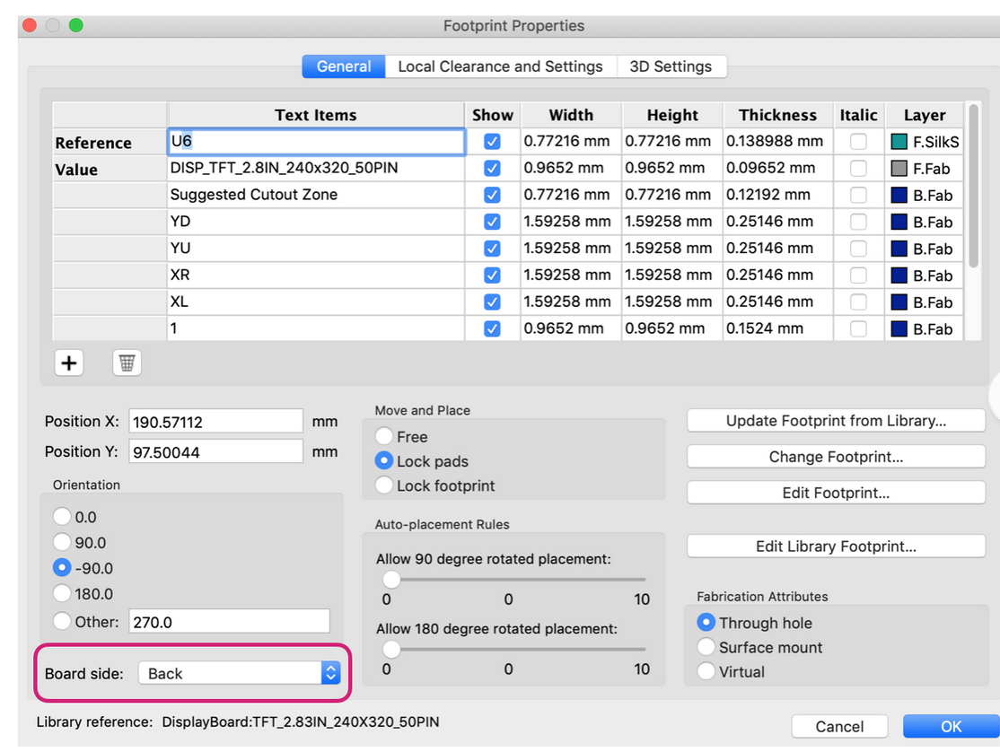

**General layout tips**
* Keep the STMPE811 part as close to the connector pads as possible 
* Do not place any footprints in the cutout zone. 
* Orient the SD Card molex connector on the edge of the board properly, as shown in the image below. 

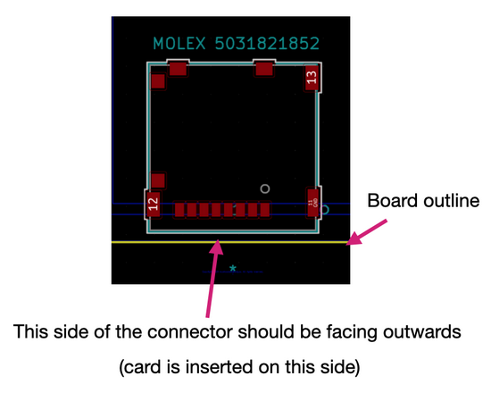

