# LED board Activity

#### Introduction: What is the purpose of this board? 
This week, we'll be designing a board to drive 48 LEDs. These LEDs will illuminate an acrylic tower on top of our UberRadio, as shown in the image below. Unlike this sample tower which glued LED strips to each piece of acrylic, we will directly place our PCB along a side of the tower. This means the spacing between the LEDs on our board needs to be set according to the dimensions of the tower. We've already designed the CAD and figured out the spacing for you and we've written a python script that will automatically lay out the LED footprints according to these dimensions (this is one of the advantages of using a tool like KiCAD and we've provided more details in the instructions that follow). 

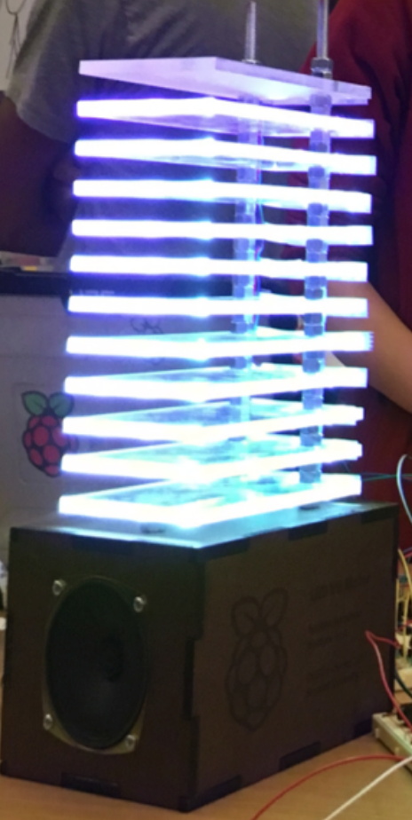


### Step 1: Make the schematic 

We've provided the first LED symbol of the schematic for you, but you'll need to make the rest of the schematic. This should be quick as you can copy paste items, but try to do some of the items below without copy pasting to get some practice: 
* Add an LED symbol by using "Shift - A" or go to "Place - Symobl". Go to the LED library and select the "APA102-2020" symbol.
* Assign the following footprint "LED-APA102-2020" in the "LED_SMD" library to the LED symbols.  
* Add +5V and GND by using "Shift - P" or go to "Place - Power Port".
* Add text to your schematic to make it clearer. To add text, use "Shift - T" or go to "Place - Graphic Text." 
* Add no connects (“Place no connection flag” in the toolbar on the right) to pins 2 and 3 of the D48 and add "n/c" in graphic text next to both pins to increase readability. 
* Annotate the schematic by going to "Tools - Annotate Schematic". To match the numbering in our schematic below (where each bank contains consecutive numbers), select "Sort components by Y position" option as the numbering order.

This is what your final schematic should look like (don't worry about the fiducials for now, as we will cover them in a later step): 

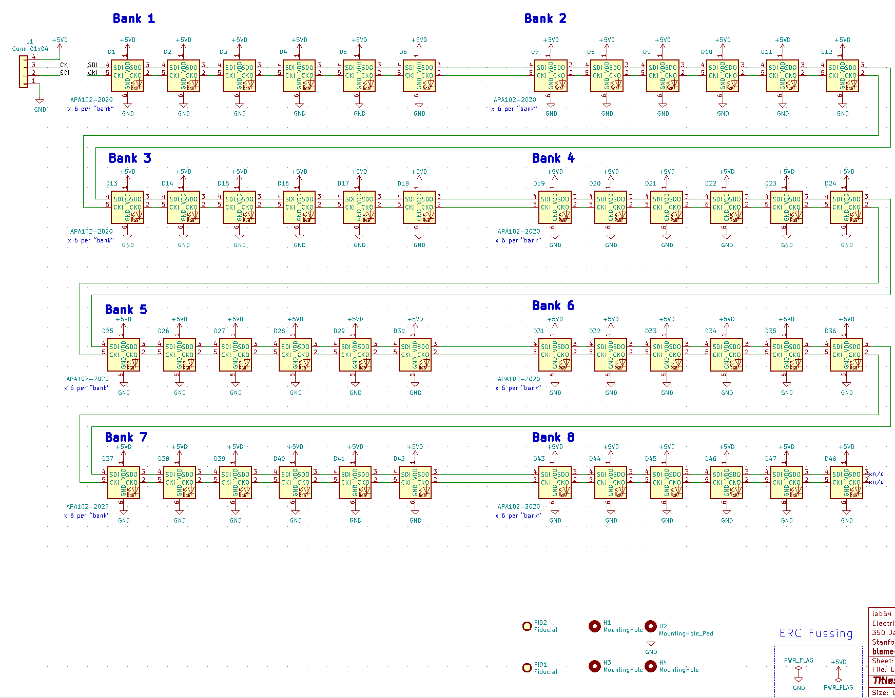


**What is the ERC box in the bottom right corner?**

If you delete this box and run the ERC (Electrical Rules Checker - on the top toolbar and has the bug logo), you'll notice that it complains with the error "Pin connected to other pins, but not driven by any pin." This occurs because KiCAD cannot find a component in the schematic that is the power output that will supply power to the LED's 5V pins. 

To see this more clearly, select pin 1 (VDD) of an LED symbol, and notice that its type (this is visible in the gray bar at the bottom of the window) is "power input." Its power will come from pin 4 of the J1 connector. However, if you select pin 4 of the J1 connector, its type is only passive because it's a generic connector. Therefore, we need to introduce a power flag to tell the ERC that a pin that isn't a power output is the source of power. We will talk more about the ERC with later boards. 

### Step 2: Layout the components 

Now that our schematic is done, we'll move on to layout. Update the PCB from the schematic (Tools -> Update PCB from Schematic) and open the PCB Layout Editor.

Import [LED_Board_Outline.dxf](./LED_Board_Outline.dxf) into the layout editor as well.

#### Arranging the LEDs

As described in the introduction, the LEDs will be arranged in a grid to backlight a tower of acrylic pieces. The spacing between rows is specified by the acrylic tower dimensions, and the spacing between LEDs within a row should be even to get a good lighting effect. It would be quite tedious to calculate and move each of the 48 LEDs into position manually. Luckily, KiCad offers Python scripting to automate tasks like this! We have included a Python script for you called [led_layout.py](./led_layout.py) (you can also write your own; see below for help getting started). The script selects the 48 LEDs and positions and orients them into a grid.

Go to "Tools -> Scripting Console" to open the KiCad Python shell. You can interact with this like any other Python shell.

<details>
<summary><b>Basic KiCad Python scripting</b></summary>
Here are some basic commands you can run in the shell to get a feel for KiCad scripting.

1. Type `from pcbnew import *` into the shell. This gives us access to KiCad libary functions.
2. Type `pcb = GetBoard()`. We can now use `pcb` to interact with components in the layout editor.
	a. If you type `pcb.` into the shell, you will get a list of available function calls.
3. Type `led = pcb.FindModuleByReference("D1")`. This lets us access a component in the layout editor, specified by the annotation string. 
	a. Type `led.` to get a list of available function calls. Experiment with `GetPosition` and `SetPosition`.
</details>

There are two ways of running the Python script:

1. Execute the file directly. In the shell, type: `execfile("ABSOLUTE_PATH_TO/led_layout.py")`.
2. Add the file to your Python system path and import the file.

	a. In the shell, type the following:
	```
	import sys
	sys.path.append("ABSOLUTE_PATH_TO_FOLDER_WITH_PYTHON_FILE")
	```
	b. To use import the file's functions, type `import led_layout` in the shell. You can then call any function that has been defined in the file.
	
	c. If you modify the file, type `reload(led_layout)` in the shell.

Your LEDs should look like this (in the screenshot we've hidden the ratsnest and the front copper layer):
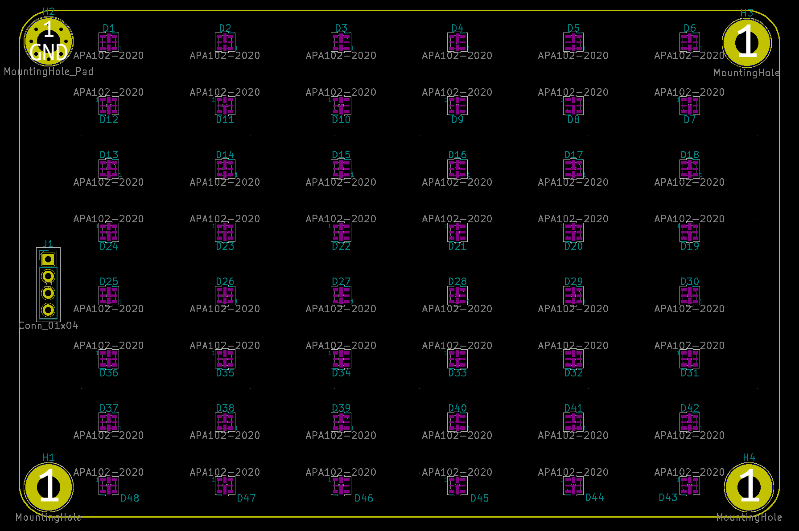

<details>
<summary><b>Writing your own Python script</b></summary>
You are welcome to write your own Python script too! All KiCad-related functions are found in the `pcbnew` library.

Some resources to get started:

* [Example of arranging components in a circle](http://kevincuzner.com/2017/04/28/arranging-components-in-a-circle-with-kicad/)
* [Python scripting intro from KiCad](https://docs.kicad-pcb.org/5.0.2/en/pcbnew/pcbnew.html#kicad_scripting_reference)
* [Pcbnew Python documentation](https://docs.kicad-pcb.org/doxygen-python/namespaces.html)

Note that the LEDs form a snaking pattern to minimize the length of the traces between them. 
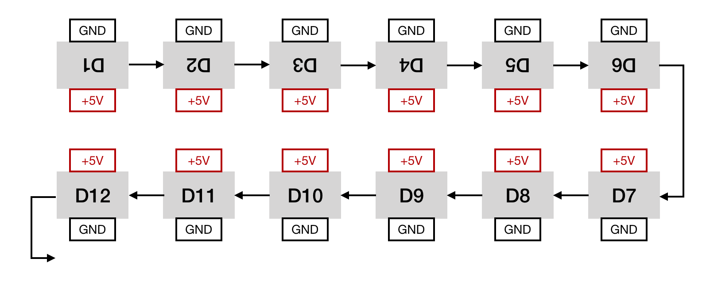

* You will need to change the LED orientations every other row because we want the +5V/GND of LEDs in adjacent rows facing each other.
* The LED numbering order should reverse every other row.
</details>

### Step 3: Place the mounting holes
To ensure compatibility with the enclosure, we need to standardize the placement of the mounting holes. We have chosen to place their centers 5mm in the x and y directions away from the respective edges. You can do this placement a number of ways:

1. Run (or write your own) the [hole_layout.py](./hole_layout.py) script we have provided.
2. Manually find the x and y coordinates of the board outline (you can do this by pressing "E" while hovering over the board edges). Calculate and set the appropriate positon for each hole (press "E" while hovering over the hole or right click and use "Move Exactly..."). The board outline is 114.5mm wide by 76.4mm high.
3. In this case, the fillet of the board outline also happens to be 5mm. Thus, the center of the mounting hole matches the origin of the fillet arc. We can use the "Position Relative To..." tool to position the mounting hole relative to this origin.

   a. Right click on the mounting hole and select "Position Relative To...".
   
   b. Click "Select Item..." and click on the fillet arc. Set Offset X and Y to 0, and press OK. 
   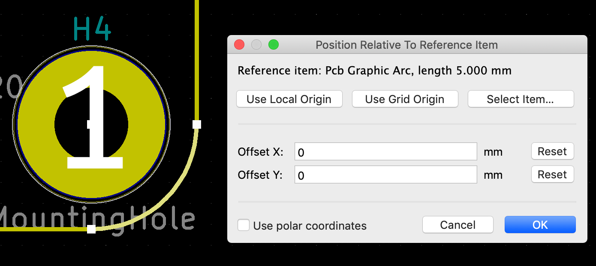
   

### Step 4: Flip the connector 
We want our board to be flush against our acrylic tower, which means that our connector cannot be on the same side of the board as the LEDs. Since the LEDs are on the top layer, we need to move the connector to the bottom layer. To do this, select the connector and press "F" (or right click on the connector and select "Flip"). This will flip the connector as shown in the image below. 

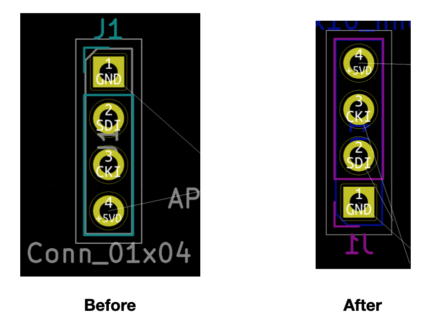

Notice that the silkscreen for the connector is now on the back of the board and will help us during assembly to make sure we aren't wiring the connector backwards. To see what layer the silkscreen is on now, you can toggle these buttons on the right sidebar. 


You can also view your board in the 3D viewer (go to "View" - "3d Viewer") to get a better sense of what side of the board components will be on. 

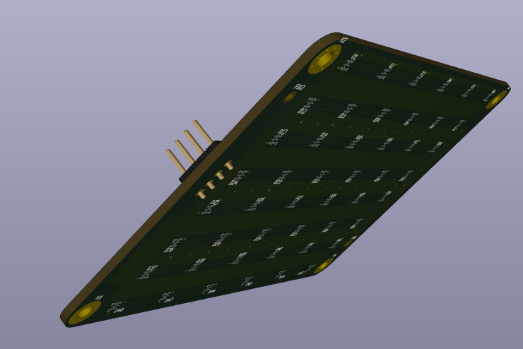

### Step 5: Add Fiducials 

<details>
    <summary markdown="span">What are fiducials and why do we need them?</summary>
 
> A fiducial is a mark on the top (and bottom if the pcb has 2 layers) copper layer that is used by the vision system of a pick and place machine to recognize where the copper components on a PCB are. When using a pick and place machine to build a board, fiducials are necessary on each side that has SMT (surface-mount technology) components. 

 

(Image Souce: LadyAda)
</details>

<details>
 <summary>How many fiducials do you need?</summary>
 
>  This depends on the manufacturer you're working with. At a minimum, you need two fiducials. The first tells the machine where the x,y coordinates of a corner is, while the second tells the machine what the board orientation is. A third fiducial can help the machine account for any shrinkage or stretch in the PCB. This warping can happen after one side of the board is reflowed. 
</details> 

 When you're placing your fiducials, you should place them as far apart as possible on opposite corners of the board to get better precision with the pick and place machine. 
  


**Steps to add fiducials to your board** 


Open up your schematic and add two fiducial symbols. To do this, go to "Place" -> "Symbol". Click where you want to add it to the schematic (on the bottom, near the mounting holes is a good spot) and the symbol library will open up. Select fiducial marker as shown below. 

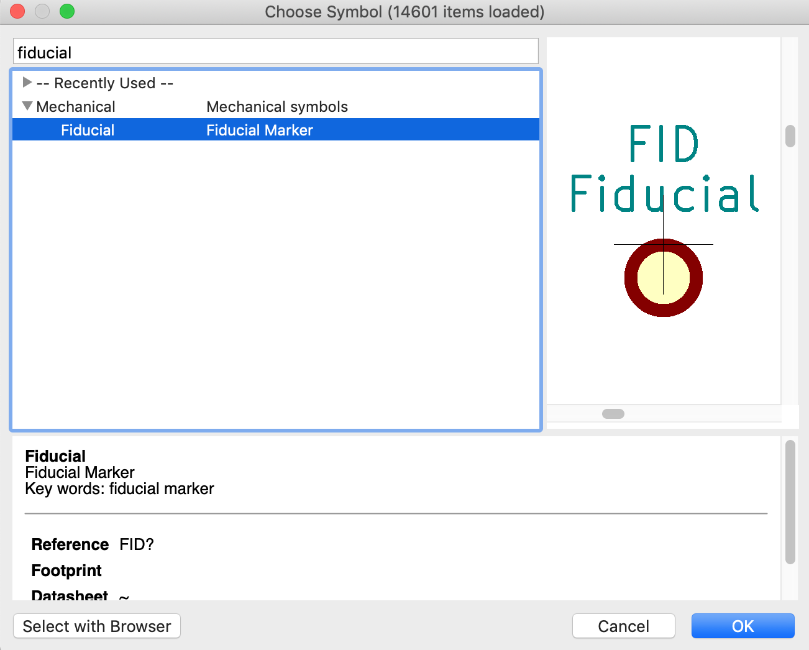


Annotate the fiducials by going to "Tools" - "Annotate Schematic" and press Ok. 

Finally, attach a footprint to the fiducial symbols by selecting the symbol and pressing "e". Use the footprint field to open up the footprint library browser and find the fiducial library. Select "Fiducial_0.5mm_Mask1mm". 

Next, open the board in Pcbnew and select the "Update pcb from schematic" button in the top toolbar (next to the little bug). Your fiducial footprints should appear. Place them as far away as possible from each other on the board.


### Step 6: Routing

Next, we need to add traces between the components. We recommend starting by wiring the SDI and CKI lines, as shown below. (Please note the fiducials in the images below are bigger than they should be if you selected ("Fiducial_0.5mm_Mask1mm")). 

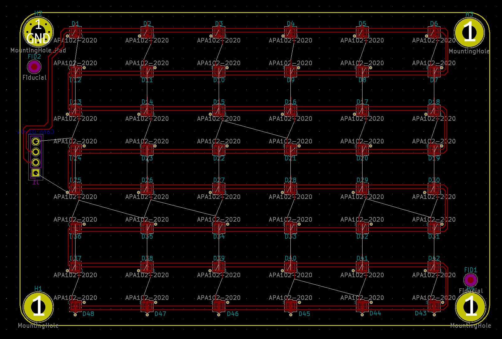

Next, connect the 5V lines. Since the LEDs draw a lot of current, we want to use the thickest traces possible. One alternative to drawing traces is to created filled zones. To add a filled zone, use the following button. 

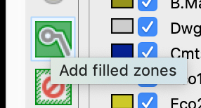

Set the net you want associated with that zone. 

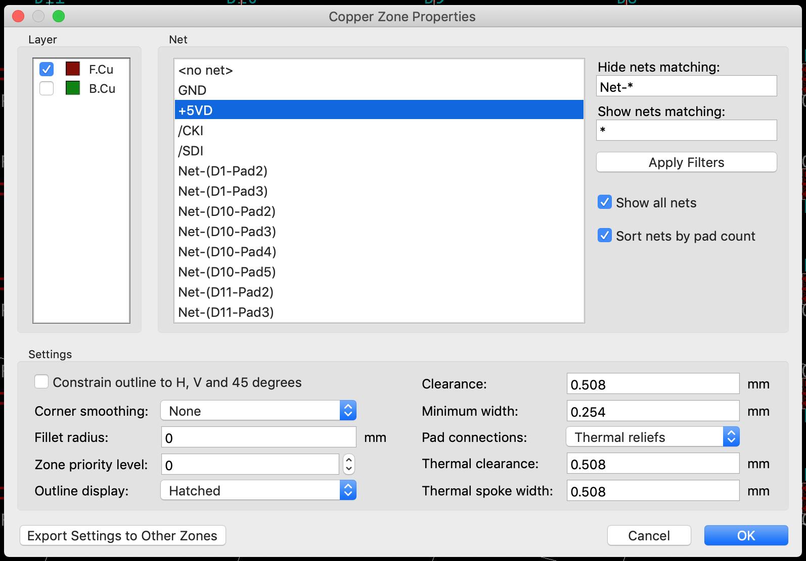

Draw a zone that connects all of the 5V components as shown. Notice that KiCAd automatically creates clearance zones for you. That means that if the polygon you draw goes over components that should not be connected to 5V, KiCAD will automatically reshape the polygon to avoid that region. Notice that these clearances can be refreshed. If you move a component that interferes with the filled zone, simply right click on the filled zone, go to "Zones" - "Fill" and it will automatically refresh the clearance zones. 

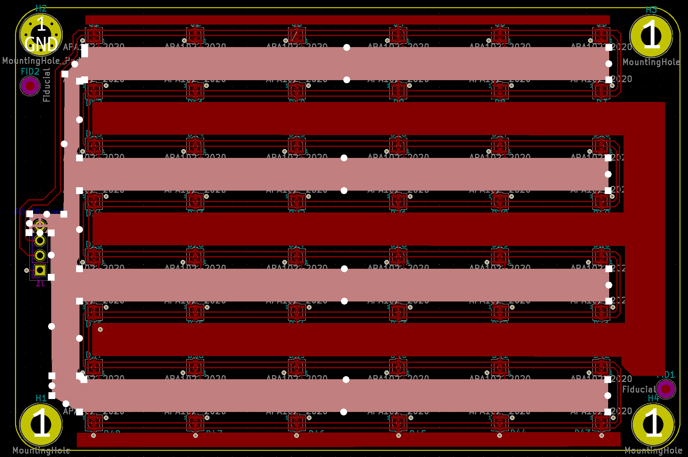

Repeat the same process for GND. If your zones remain dashed instead of solid, make sure the zone is connected to GND somehow (either through a trace or a via associated with the GND net).

<details>
    <summary>What is thermal relief in filled zones?</summary>

> Thermal relief consists of small traces used to connect a pad to a large filled zone. If the pad was directly connected to a zone then it would be very difficult to heat up the pad to a high enough temperature to make a solder joint because of the thermal mass of the copper zone. Using a small trace instead reduces heat flow and makes it easier to solder. 

> 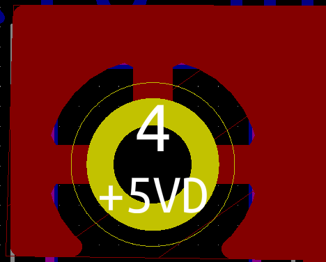

 </details>


### Step 7: Add vias 
 
<details>
 <summary>What is a via?</summary>
 
> A via is a hole in a PCB that allows current to pass from one layer to another. Vias can either be tented, meaning that they are covered by the soldermask so nothing can be soldered to them, or untented, meaning that we can solder a component to it. 
One reason to add vias is to facilitate routing between components by avoiding intersections between traces by routing some through a different layer. Another reason is to use them as "thermal vias" to transfer heat away from components on the board.


</details>

**Steps to add vias to connect the ground pads to the bottom layer ground plane**

Place a via next to every ground pad of an LED that cannot be routed to a larger ground trace. There should be one of these per LED footprint, as shown in the bottom left corner of the image below. You can select the net to associate with a via by clicking on it and pressing "e". 

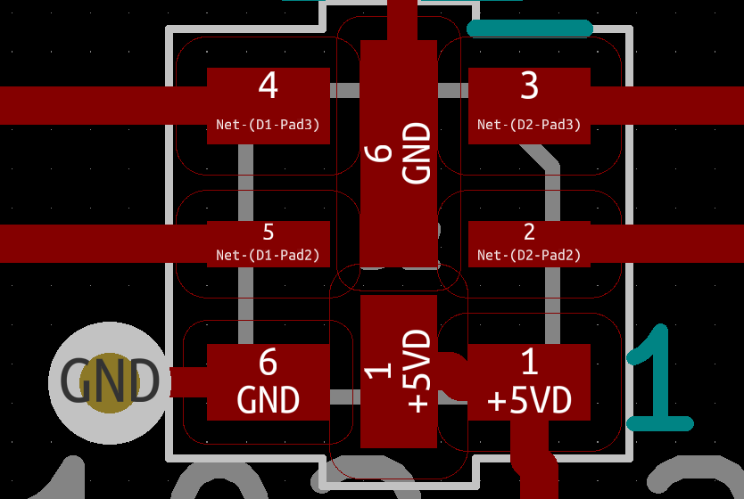

Next we will add thermal vias. We will fill the back layer of the board with copper and set this as a ground plane. We'll create vias that connect the ground pins of the LEDs on the top layer to this large copper pour. The back layer will act as a heat sink and its large surface area will increase heat transfer via convection. Efficiently place these vias by adding one and creating an array (right click on the via and go to "Create array..."). Some sample dimensions for the array are a horizontal count of 28, with horizontal spacing of 3.5mm and vertical spacing of 3mm.


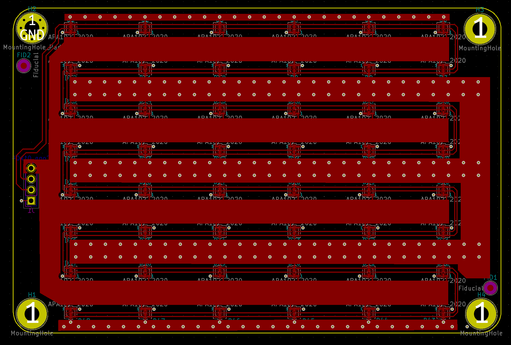


<details>
 <summary>More on adding thermal relief to a PCB</summary>
 
> First, note that adding lots of thermal vias to your PCB does not guarantee that your components won't overheat. You should read the datasheet of your components to determine how hot your components might get and how much thermal relief is necessary. You should also be aware that vias that are only thinly plated with copper will not provide as much heat transfer as vias that are filled with copper, but filling vias with copper is more expensive. In addition the more vias you add to your board, the higher the cost of the board will be. 

> One alternative to thermal vias is to use an aluminum substrate for your board. This kind of PCB is commonly referred to as a Metal Core PCB (MCPCB). Aluminum substrates and copper substrates are commonly used in the metal core, as they both have good heat transfer and dissipation properties, and aluminum substrates are more frequently used because they are cheaper. 

Here is a visual description of the structure of a MCPCB
> 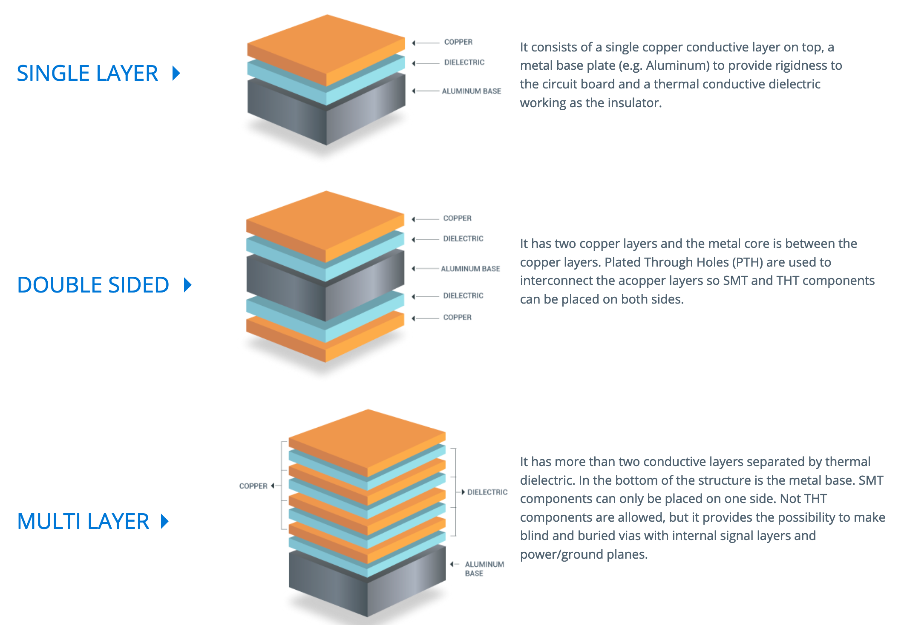

(Image credit: PCB Unlimited)

> For our project, using an aluminum substrate would have been a good way of providing thermal relief to the LEDs on our board, but the cost increases by 5x, so we've decided to use thermal vias instead. 

</details>


### Step 8: Add copper pour on bottom layer

Add a ground filled zone on the bottom layer.

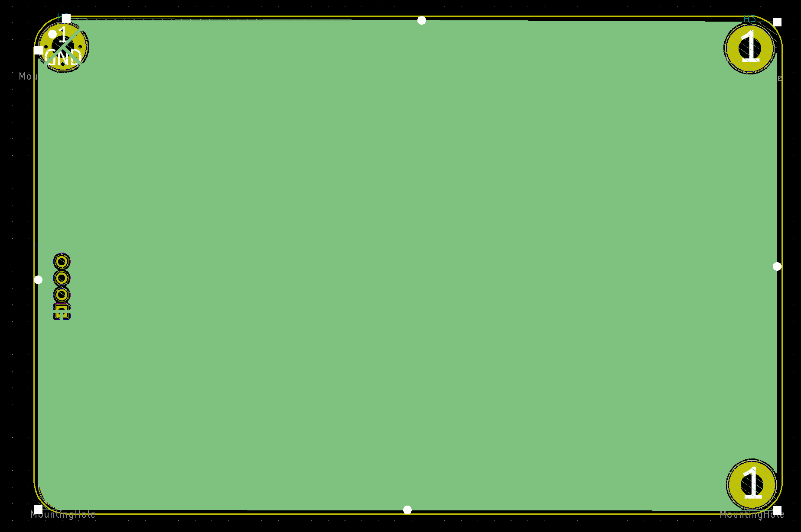


### Step 9: Change your clearance settings (Note: This is a recently added step)

If you run the DRC at this point, you'll notice that you get many errors about pads being too close to each other, as shown in the image below. 

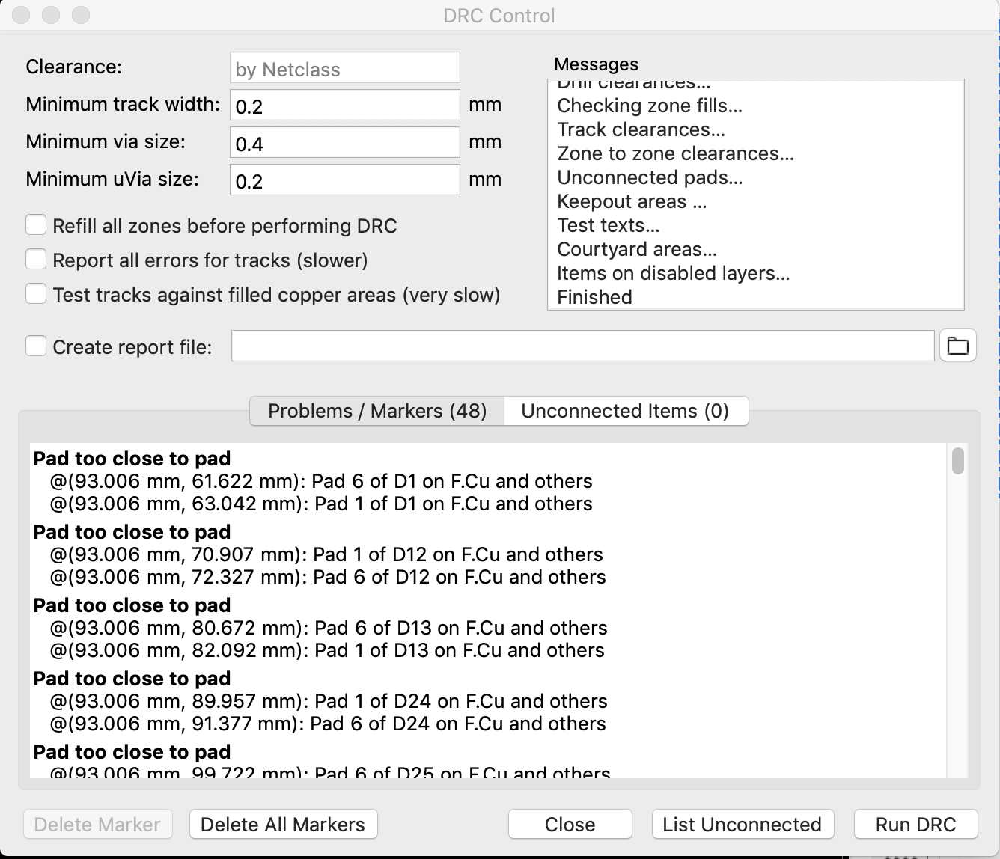


What "too close" means depends on KiCAD's clearance rules. The default clearance rules for KiCAD are more restrictive than our manufacturer's rules, so we'll define a new set of rules that match our manufacturer's and recheck the board. For this board, we will be using JLCPCB as our manufacturer. You can see their manufacturing rules [here](https://jlcpcb.com/capabilities/Capabilities).   

To do this, go to "File" - "Board setup" 

Under design rules, go to "Net Classes". Notice that KiCAD already has two net classes defined: Default, Skinny. We want to define a new set of rules according JLCPCB's rules. Create a new net class (using the + symbol) and name it "jlcpcb". In our case, we need to adjust the clearance setting as this is the reason our DRC was throwing errors (the default clearance is 0.2 mm, but the min clearance for JLCPCB is 0.127 mm). Edit this setting and feel free to edit the other settings according to the JLCPCB webpage linked above. 

Next, you need to assign all of your components to the JLCPCB net class. To do this, go to "Assign Net Class" set the "New net class" to "jclpcb". Click on "Assign to Listed Nets" to reflect the changes on all of your nets. 

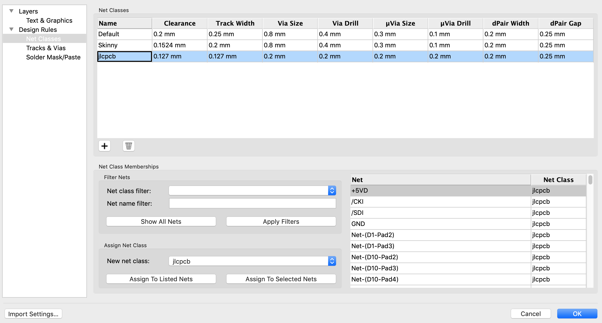

After these changes, your DRC should run without any errors. 


### Step 10: Generate Gerber files 

Select File -- Plot

Select an appropriate Output directory Folder.

Select "Run DRC." Make sure your board passes this test by having 0 problems.

Select "Plot" to generate the gerber files.

Select "Generate Drill Files" to generate the drill files.

Locate these newly generated files on your computer, and open them with Gerbview to check that everything looks good. You're done with the protoboard activity!

### Step 11: Submit your files so we can order your board!

Once you've generated gerber files, zip your files and upload your board files to our workshop google drive and include a text file with your name and the address you'd like us to send it to.

 
