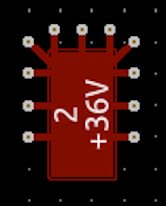

# Summary of feedback on the power board 

### Spacing between the terminal blocks and the board outline 
* We will be connecting the powerboard to other boards via the terminal blocks and inserting wires into the terminal blocks. Because the powerboard is surrounded on all sides by other faces of the uber radio (see CAD image), we need to add clearance between the edges of the power board and the terminal block. Without this clearance, the wires will have to bend at a right angle right at the exit of the connector. 
* Aim for at least 1.5 cm of clearance from the edge. 

### Use thick traces 
* Make your traces as thick as possible. A lot of current is going through the board, so it’s especially important to avoid thin traces on this board. 
* As a general rule, make your traces as thick as the pad it’s connected to. 

### Bypass capacitors 
* Many of the capacitors on the power board act as bypass capacitors to reduce noise going into a component, as shown in the image below. 
* Your bypass caps should be as close as possible to the component they are bypassing. You should also connect the capacitor to the component it is bypassing directly with a trace. Don’t use vias to make the connection, as it defeats the purpose of using the capacitor to reduce the noise on the component it’s bypassing. 

### Keep capacitors close to the circuit they belong to 
* We saw some boards that grouped all of the capacitors in one region of the board and connected them to their appropriate layer with vias. Instead aim to keep your capacitors as close as possible to the schematic block they belong to. 

### Add many vias to connect high current pads to other layers 
* For components that are carrying large amounts of current, use many vias to connect a pad to a different layer, as shown below: 

