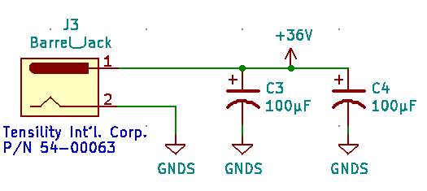
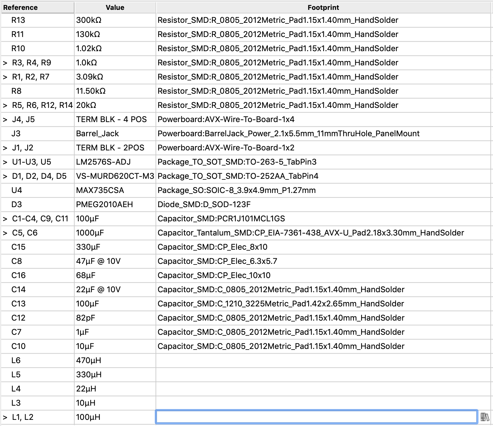

# Powerboard Activity: Part 2

This is **part 2** of the power board activity. You can find instructions for part 1 [here](../../Powerboard/Powerboard_Activity/Part1_Instructions.md).

### Step 0: Add capacitors to schematic
There are a two more components we need to add to your schematic from last week.

* Open up your Powerboard schematic from part 1 of this activity. 
* Add two 100μF capacitors between 36V from the barrel jack and ground, as shown below. We've added these because (TODO: why?).

### Step 1: Assign footprints 
* Import the Powerboard footprint library we've created that contains the footprints that don't come with a standard KiCAD installation. Open the "Footprint Editor" and go to "File"->"Add Library" and select "Powerboard.pretty". 

Assign footprints to the symbols in your schematic. You can do this efficiently by selecting the "Edit SymbolFields" button in the top toolbar.  

Assign footprints as follows: 

Annotate your schematic ("Tools" -> "Annotate Schematic")

### Step 2: Create a .kicad_pcb file to layout the board 
* Open up the project file (.pro) and select the "PCB Layout Editor" button. KiCAD will ask you to confirm that you want to create a new .kicad_pcb file. Click yes. 

### Step 3: Change the board to be a **four layer** board. 

This power board will be composed of four layers (TODO: insert explanation) in the following order:

By convention, when referring to the number of layers in a PCB, we refer to the number of copper layers. 
* Go to "File" -> "Board Setup" 
* Set the number of "Copper Layers" to 4, as shown below. Notice that In1.Cu and In2.Cu (short for "Inner Layer") are added to the list of layers.  
* Set In1.Cu (our +36V layer) and B.Cu (our GND layer) to be a "power plane", as shown below. Note that assigning these layers to being a power plane in the board setup section does not actually have any effect on the layer in KiCAD, but this information is used by the autorouter during production. 

### Step 4: Add the board outline 
Import the [provided board outline](https://github.com/lab64makerspace/intro2PCBdesign/blob/master/Overview%20%26%20Details/Powerboard/Powerboard_Activity/Power_board_outline.dxf).

#### Step 5: Layout the footprints 
Unlike the LED board, where are component placement was constrained by mechanical requirements, the power board allows for a lot more flexibility. Here are some suggestions to help guide you.

Here is a suggested floorplan. These groups correspond to the labeled clusters of symbols on your schematic. Note that the groups in black text are relatively fixed: we want the barrel jack connector near the bottom of the power board and the LED 5V supplies near their respective sides.

**General tips**

* Try to place components to minimize trace lengths within groups. However, do not place components extremely close together, as this could lead to unwanted solder bridges or other mistakes when soldering and assembling the board.
   * When you click on a footprint in the PCB Editor, it will highlight the corresponding symbol in the Schematic editor. This will help you figure out which footprints should be grouped together.
* You may find it helpful to rotate footprints to minimize criss-crossing ratsnest lines: you can do this by clicking on the footprint and hitting "R".
* Remember that we have +36V and GND layers, so all connections to 36V and GND can use vias instead of traces. This helps free up the minimal trace length placement constraints. 
* Within each group, we suggest placing the terminal block first, as you know that has to sit near the outer edge of the board. Then place the voltage regulator, as many other components within the group will connect to it.
* When placing the terminal blocks, note that the larger part of the footprint is where the external wires will connect, so they should face outward.

(TODO: more tips??)

We know this is a daunting step, so please reach out to us if you have questions or if you'd like us to look over your layout!

### Step 6: Add thermal vias 
Because the LEDs will draw significant amounts of current, we need to add thermal vias to prevent components from overheating. Although it is generally a bad idea to add vias on the pad of a component (TODO: insert explanation), it's ok to add vias to the ground pad of the LM2576S component (TODO: insert explanation).   

Recall from last week's workshop that the bottom of the LM2576S component is a tab connected to ground. In the datasheet, under "Pin Configuration and Functions", it says to "put a copper plane connected to this pin [the tab] as a thermal relief", which is what we are effectively doing with these thermal vias. This is similar to the vias you added to the front ground planes on your LED board.

 

### Step 7: Create the power planes 
1) Create a **GND** power plane on the bottom copper layer (B.Cu). 
* Select the B.Cu layer as the active layer, by double clicking on the left of the layer in the right sidebar until the black arrow appears next to the B.Cu layer as shown below. 
* 
* Next create a filled zone covering the entire B.Cu layer (TODO: insert explanation on why the copper should fill the entire layer) and assign it to the GNDS net list. (Refer to the LEDboard activity for instructions on creating filled zones). In order for this filled zone to cover as much of the layer as possible, draw a rectangle that is larger than the board outline. The software will automatically fill only the portion of the rectangle that is inside the board outline and within a clearance margin from the edge. 

2) Repeat the same process to add a **+36V** filled zone on the entire first inner copper layer (In1.Cu).  

3) Add a **+5VA** filled zone on second inner copper layer (In2.Cu). To avoid introducing noise in this part of the circuit which includes analog components, we want to keep this zone only over the part of the circuit that uses 5V analog. If you followed our suggested layout, this means that this zone should be in the bottom right corner of the board. 

If you make changes to the layout of your board after creating the filled zone, you can automatically refill a zone by selecting the zone and pressing "B." 
