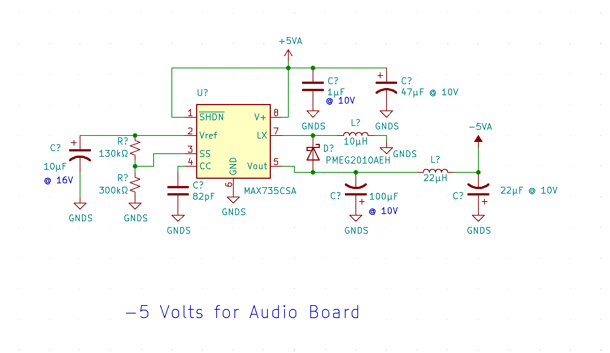
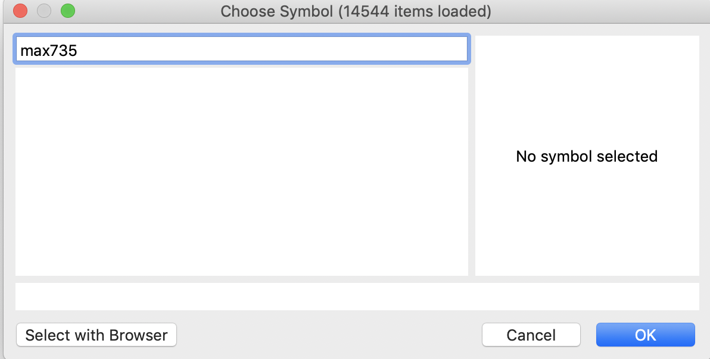
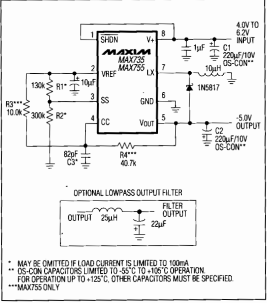
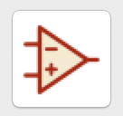
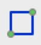
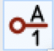
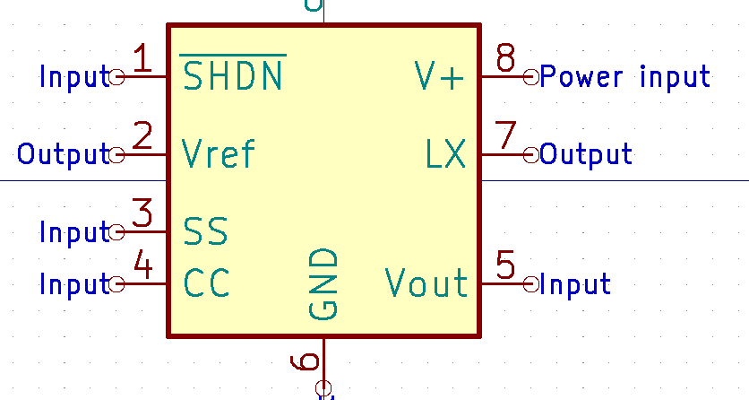
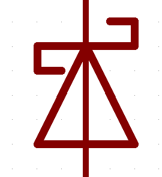
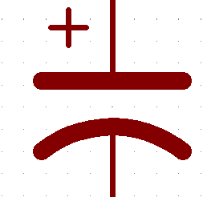
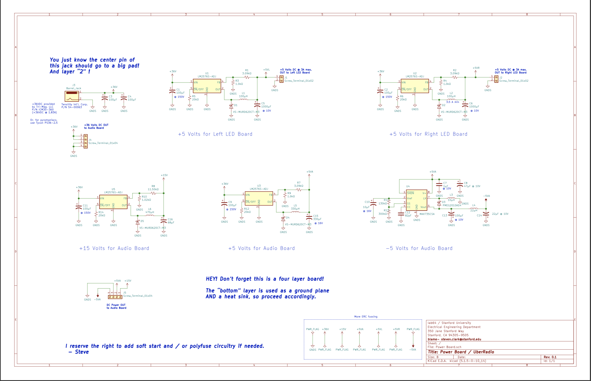

# Power board Activity

#### Introduction: What is the purpose of this board? 
This week, we are building the backbone of this entire project: the power board. If you are interested, please see the content section for a detailed description of all the thought and planning that went into the design of this board. 

### Week 1: Make the schematic 

We've provided the majority of the schematic for you except for one critical section. This vital circuit is necessary for supplying -5V to the audio board:

We need to finish this section before moving on to the board design. Unfortunately, there is no native kicad symbol for the MAX735. If you don't believe me, go ahead and search for it yourself.

**Making a symbol**

Often times in your schematic, you will use parts that don't have ready made symbols or maybe you want to edit the symbols so that your schematic looks clearer. Since we will be making the symbol for the MAX735, go ahead and open 
[the datasheet](https://datasheets.maximintegrated.com/en/ds/MAX735-MAX755.pdf) so that we know what pins the product has. When you're making a symbol, there are a few general rules to remember: 
* Inputs go on the left, outputs go on the right
* positive voltage goes on top, negative voltage and GND go on bottom
* If the datasheet specifies a circuit that you want to use, it's generally best to use the same pin layout

Based on the rules above, we look at the datasheet (go to page 5) and see that our ideal configuration is at the bottom of the page! That means that we can copy the layout of the schematic on the datasheet with some minor modifications.

Open up the symbol editor from your .pro file. 

File -> New Symbol -> Power_Board -> OK.
Fill out the fields as following (most are default).
Change the name field to "MAX735CSA-Regulator_Switching"

Click on the graphic rectangle tool in the corner of the screen and draw a box at the center. The size doens't have to be exact but there needs to enough room to include all the pin names. 

Once you're happy with your box, hover over it and click e. Change fill style to Fill with body back ground color. Now click the pin tool from the toolbar.

Click anywhere on the screen and you'll see the properties popup. Note that the pin numbers are EXTREMELY important to get right because they corresond to pads on a footprint. Go ahead and complete the following pins. Once you create the pin, you can move it where ever you like and if you need to rotate it press r. 

| number |  name |     type     |   
|:------:|:-----:|:------------:|
|    1   | ~SHDN |     input    |   
|    2   |  Vref |    output    |  
|    3   |   SS  |     input    |  
|    4   |   CC  |     input    |   
|    5   |  Vout |     input    |  
|    6   |  GND  |  power input |
|    7   |   LX  |    output    | 
|    8   |   V+  |  power input |

Follow this diagram so that you know approximately where to put things.

Cmd S to save. Congrats! you have finished your first symbol. 

Did you find it interesting that adding the ~ in front of the first pin added a bar on top of the pin name? This is the way that the schematic tells pcb users that the pin is triggered on low.  

**Finishing the schematic**

We'd like you to try to finish the rest of the schematic yourself! 

You should be able to find most of these components on your own but for the ones that you might not be familiar with, we've included their names and images below.

 D_Schottky   
 CP1

Finally, there are a couple output jacks that have not yet been added. Please look at the image below and add all necessary screw terminals so that your other boards can get power!

 

For this week's deliverable, please email lab64CA@ee.stanford.edu a picture of your schematic. Thank you for all your hard work!

### Week 2: Footprints & Layout

Coming soon!
