# Powerboard Activity: Part 2

This is **part 2** of the power board activity in which you'll be laying out the power board! You can find instructions for part 1 [here](../../Powerboard/Powerboard_Activity/Part1_Instructions.md).

You can find an explanation for the overall power board design [here](../../Powerboard/Powerboard_Content/README.md).

You can find a summary of PCB layout guidelines [here](/Resources/PCBLayout_Advice.md). 

As a reference, here is an CAD overview of the Uber radio with the powerboard (the front transparent board): 

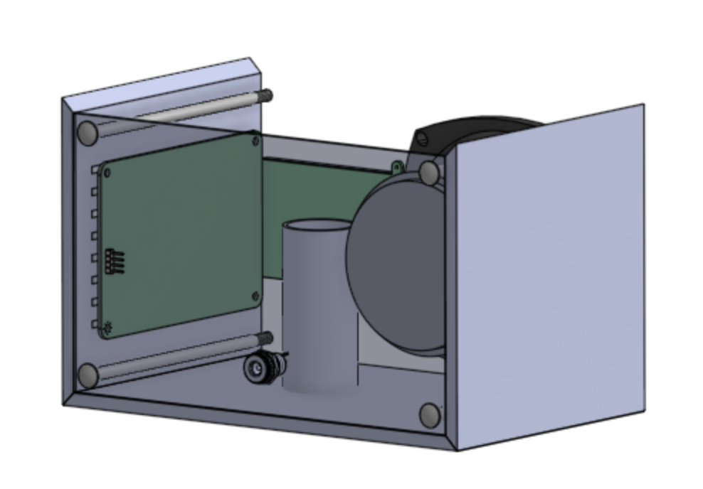

### Step 0: Make a few modifications to your schematic 

#### Switch the pin numbers on the barrel jack symbol 
* Go to "Tools"-"Symbol Library Editor" 
* Find the barrel jack symbol 
* Double click on the pin numbers and change them as shown in the image below

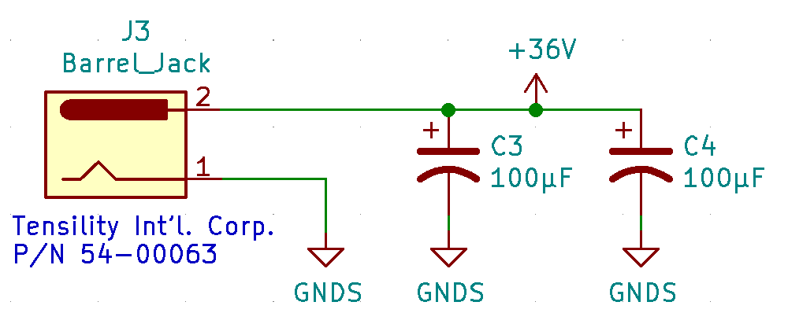

#### Switch the pin numbers on the 4-Pos Terminal Block 
* Repeat the same process as with the barrel jack to swap the pin numbers on the Term Blk 4-Pos underneath it. 

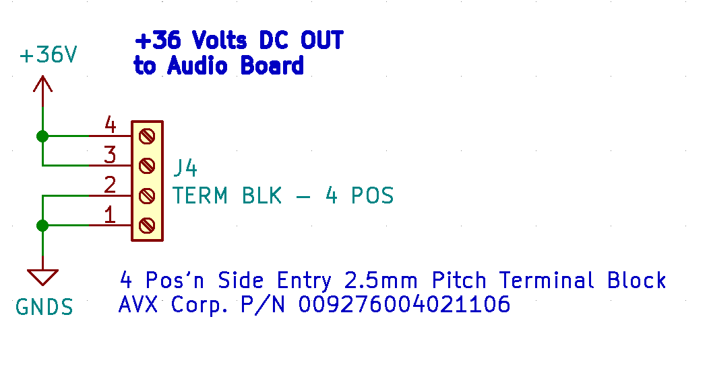

#### Add capacitors to the schematic
There are a two more components we need to add to your schematic from last week.

* Open up your Powerboard schematic from part 1 of this activity. 
* Add two 100μF capacitors between 36V from the barrel jack and ground, as shown below. We've added these because they help the voltage stay constant in case of heavy [loads](https://electrical-engineering-portal.com/few-things-that-capacitors-do-perfectly) and [shunt](https://en.wikipedia.org/wiki/Decoupling_capacitor) any noise from voltage spikes or ground bounce. In short, we add these caps to get as pure of a 36V DC signal as possible. 

### Step 1: Assign footprints 
* Import the Powerboard footprint library we've created that contains the footprints that don't come with a standard KiCAD installation. Open the "Footprint Editor" and go to "File"->"Add Library" and select "Powerboard.pretty". 

* Assign footprints to the symbols in your schematic. You can do this efficiently by selecting the "Edit SymbolFields" button in the top toolbar.  

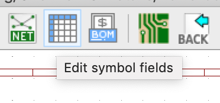

* Assign footprints as follows: 

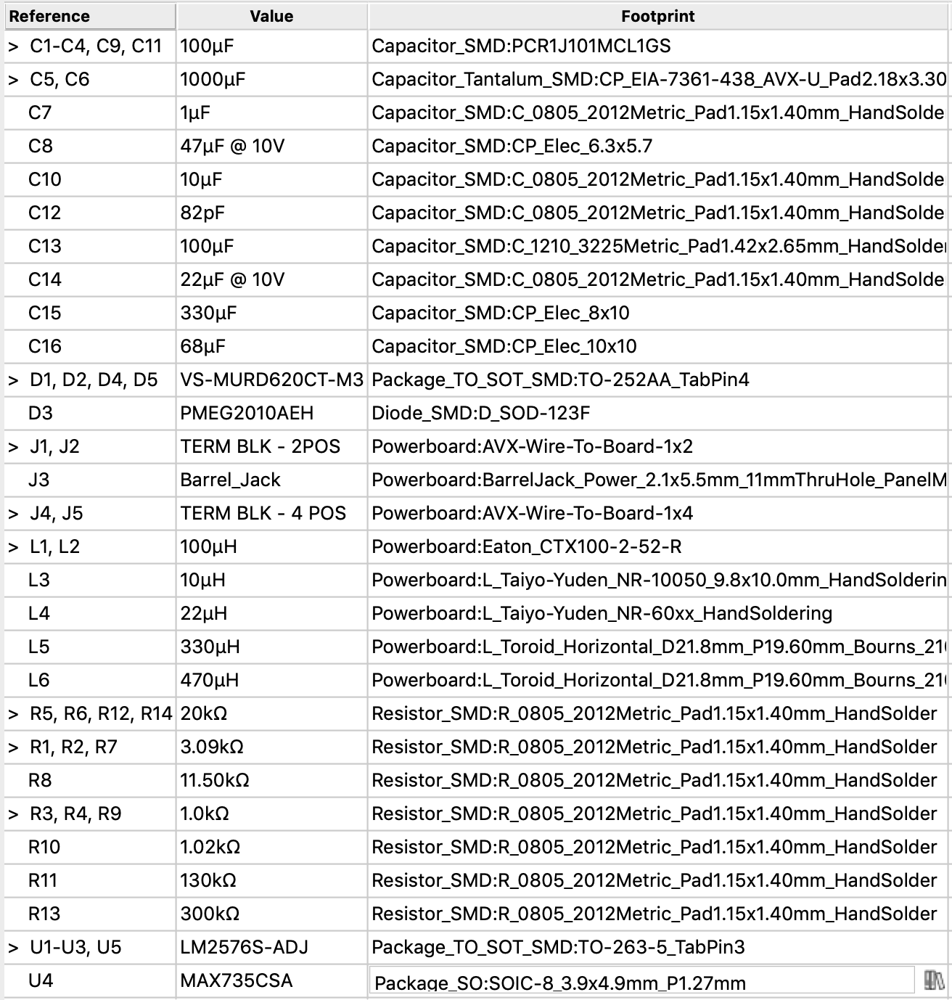
 

Here is our annotated schematic for reference (click on the image for better resolution). You will need this schematic reference to distinguish between the 100 micro F capacitors that have different footprints. 
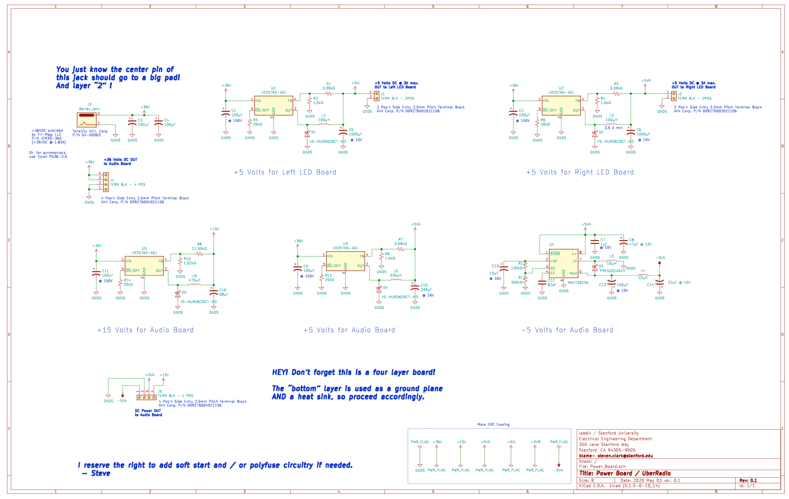
 

Note:  
These are the footprints for the inductors (same as shown in the image above):
- 100uH - Inductor_SMD:Eaton_CTX100-2-52-R
- 470uH - L_Toroid_Horizontal_D2121.8mm_P19.60mm_Bourns_2100
- 10uH  - L_Taiyo-Yuden_NR-10050-9.8x10.0mm_HandSoldering
- 22uH  - L_Taiyo-Yuden_NR-60xx_HandSoldering
- 330uH - L_Toroid_Horizontal_D2121.8mm_P19.60mm_Bourns_2100
  
* Annotate your schematic ("Tools" -> "Annotate Schematic")

### Step 2: Create a .kicad_pcb file to layout the board 
* Open up the project file (.pro) and select the "PCB Layout Editor" button. KiCAD will ask you to confirm that you want to create a new .kicad_pcb file. Click yes. 

### Step 3: Change the board to be a **four layer** board. 

This power board will be composed of four layers in the following order:
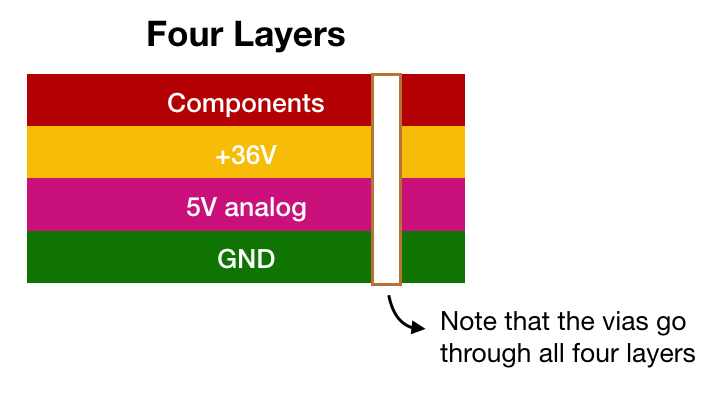
 
We will use four layers in order to simplify our trace routing; if we dedicate a layer for each voltage level (+15V, +5V, -5V) then we can route our voltage-specific traces on their respective layers. 
By convention, when referring to the number of layers in a PCB, we refer to the number of copper layers. 
* Go to "File" -> "Board Setup" 
* Set the number of "Copper Layers" to 4, as shown below. Notice that In1.Cu and In2.Cu (short for "Inner Layer") are added to the list of layers.  
* Set In1.Cu (our +36V layer) and B.Cu (our GND layer) to be a "power plane", as shown below. Note that assigning these layers to being a power plane in the board setup section does not actually have any effect on the layer in KiCAD, but this information is used by the autorouter during production. 

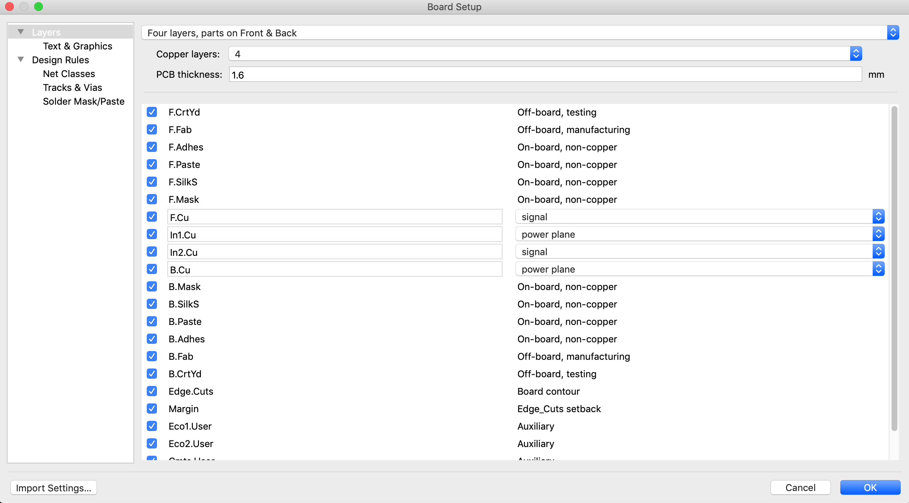

### Step 4: Add the board outline 
Import the [provided board outline](https://github.com/lab64makerspace/intro2PCBdesign/blob/master/Overview%20%26%20Details/Powerboard/Powerboard_Activity/Power_board_outline.dxf).

### Step 5: Add mounting holes 
Add four mounting holes to your board to mount it to the Uber radio. 

* In your schematic, insert four mounting hole symbols, assign them a footprint(MountingHole:MountingHole_5.3mm_M5), and re-annotate your schematic.  
* Update your .kicad_pcb file. You should see four mounting holes now. 
* Run the powerboard_hole_layout.py script to set their position. You should obtain the following layout: 

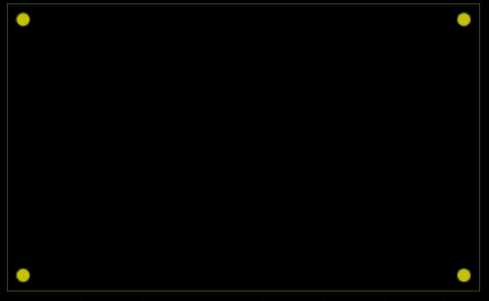

### Step 6: Layout the footprints 
Unlike the LED board, where are component placement was constrained by mechanical requirements, the power board allows for a lot more flexibility. Here are some suggestions to help guide you.

Here is a suggested floorplan. These groups correspond to the labeled clusters of symbols on your schematic. Note that the groups in black text are relatively fixed: we want the barrel jack connector near the bottom of the power board and the LED 5V supplies near their respective sides.

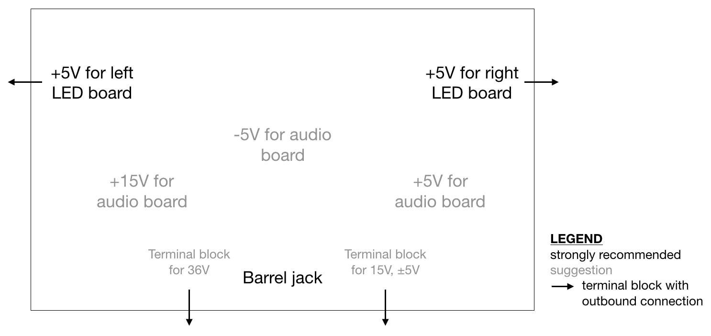

**General tips**

* Try to place components to minimize trace lengths within groups. However, do not place components extremely close together, as this could lead to unwanted solder bridges or other mistakes when soldering and assembling the board.
   * When you click on a footprint in the PCB Editor, it will highlight the corresponding symbol in the Schematic editor. This will help you figure out which footprints should be grouped together.
   * If you select a pin on a footprint in your pcbnew file and press "~", all of the pins connected to this pin will be highlighted. This can help you position your components to facilitate routing. 
* You may find it helpful to rotate footprints to minimize criss-crossing ratsnest lines: you can do this by clicking on the footprint and hitting "R".
* Remember that we have +36V and GND layers, so all connections to 36V and GND can use vias instead of traces. This helps free up the minimal trace length placement constraints. 
* Within each group, we suggest placing the terminal block first, as you know that has to sit near the outer edge of the board. Then place the voltage regulator, as many other components within the group will connect to it.
* When placing the terminal blocks, note that the larger part of the footprint is where the external wires will connect, so they should face outward.
* You can find a summary of more general PCB layout guidelines [here](/Resources/PCBLayout_Advice.md).

We know this is a daunting step, so please reach out to us if you have questions or if you'd like us to look over your layout!

### Step 7: Add thermal vias 
Because the LEDs will draw significant amounts of current, we need to add thermal vias to prevent components from overheating. Although it is generally a bad idea to add vias on the pad of a component, it's ok in a limited number of cases. It's not recommended to have a "via in pad" because vias inside of a pad make soldering to the pad more problematic (imagine your solder dripping down the vias!). Via in pad can destroy our goal of having controlled impedances (between IC package and the board) because it's hard to solder ontop of a via. There's usually a better way to make the connection (you could put the via *next* to the pad!). In our case the pad doesn't provide any signal connection. Instead the pad exists as a heat sink for the LM2576. There's a heat sink on the package of the LM2576 and the thermal conductivity (think of it as thermal performance) gets better if we solder the package's heat sink to the PCB. Thus we don't need to worry about any signal intergrity for these vias on the pad. 

Recall from last week's workshop that the bottom of the LM2576S component is a tab connected to ground. In the datasheet, under "Pin Configuration and Functions", it says to "put a copper plane connected to this pin [the tab] as a thermal relief", which is what we are effectively doing with these thermal vias. This is similar to the vias you added to the front ground planes on your LED board.

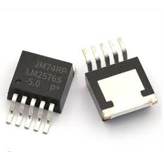 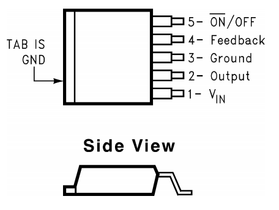

### Step 8: Create the power planes 
1) Create a **GND** power plane on the bottom copper layer (B.Cu). 
* Select the B.Cu layer as the active layer, by double clicking on the left of the layer in the right sidebar until the black arrow appears next to the B.Cu layer as shown below. 
* 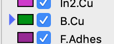
* Next create a filled zone covering the entire B.Cu layer and assign it to the GNDS net list. (Refer to the LEDboard activity for instructions on creating filled zones). We want to use the entire layer for back copper in order to maximize the layer's ability to sink heat and for it to serve as a ground reference plane. In other words, more copper means more thermal mass and thus more heat is needed to raise the temperature of the board. More copper also means we are more immune to ground bounce from our return current (think of how the layers of a PCB form a big capacitor). In order for this filled zone to cover as much of the layer as possible, draw a rectangle that is larger than the board outline. The software will automatically fill only the portion of the rectangle that is inside the board outline and within a clearance margin from the edge. 

2) Repeat the same process to add a **+36V** filled zone on the entire first inner copper layer (In1.Cu).  

3) Add a **+5VA** filled zone on second inner copper layer (In2.Cu). To avoid introducing noise in this part of the circuit which includes analog components, we want to keep this zone only over the part of the circuit that uses 5V analog. If you followed our suggested layout, this means that this zone should be in the bottom right corner of the board. 

If you make changes to the layout of your board after creating the filled zone, you can automatically refill a zone by selecting the zone and pressing "B." 

### Step 9: Add traces
* Refer to this [page](/Resources/PCBLayout_Advice.md) for more advice. 

* Notice you can toggle the visibility of the rats nest with this button. The rats nest shows you which parts should be electrically connected on the board, but can also make it hard to see your layout. 

 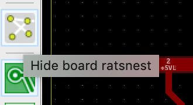
 
### Step 10: Add layer numbering
When your board has more than three layers, it is a good practice to build checks into your copper geometry to ensure that the layers were manufactured in the right order. In our case, switching the order of the inner two layers would change the capacitance of those layers, which is particularly undesirable on a power board.

Since silkscreen is not available for inner layers, PCB designers often label these layers directly on the copper to both highlight layer order to the manufacturer and build in a post-fab check. Here is a suggested layer numbering design and what the board would look like with correct and incorrect ordering:

 

Notice how the squares on layers 2, 3, and 4 slightly overlap, thus leaving a thin rectangle clear of copper on all four layers. This is intentional: the fiberglass boards are fairly opaque and hard to see through without sufficient lighting. The thin rectangle helps let more light into that local region of the board, which (1) makes it easier to quickly spot the layer numbering region and (2) makes it easier to read the numbers.

This design is only a suggestion -- you can definitely design the layer numbering however you'd like! To make these numbers, we will draw keepout areas on your copper fills.

1. Pick an area near a corner of your board (where there are no components or traces). 
2. Select the "Add keepout areas" button on the right toolbar . Click where you'd like to add the keepout.
3. In the popup that appears, make sure to:

  - Select the correct layer.
  - Check "Keep out copper pours".
  - (Optional) Check "Constrain outline to H, V, and 45 deg" if you want straight lines.

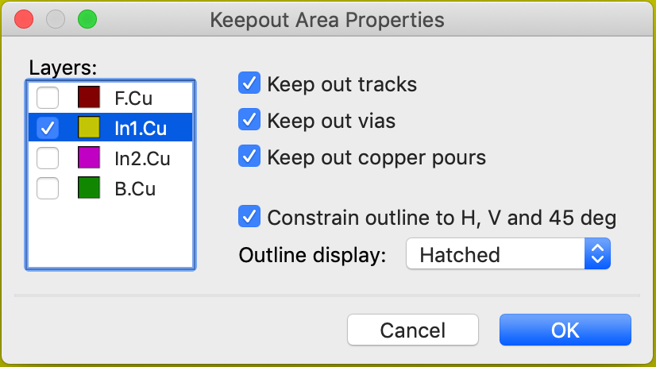

4. Now draw your square (or whatever shape you want). Once you've closed the shape, it will look like nothing happened. Don't worry! Go to Edit > Fill All Zones (or hit "B") and your keepout area should appear.

5. For the inner layers, we will also add the layer number. Select the "Add text" button on the right toolbar . In the popup that appears, be sure to select the correct layer. You can also check "Mirrored" to flip the text.

The final result for one layer number should look something like this. Repeat for other layers as desired.

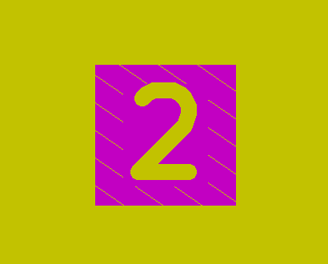
 
### Step 11 (Optional): Personalize the back silkscreen of your board!
Because the back of this board will be the back side of your Uber radio, you can add text (e.g. your name) to your back silkscreen to customize your radio. Here are the steps to do this: 

* Select the back silkscreen layer (B.SilkS) as the active layer
* Select the text symbol on the bottom of the right toolbar. Write your text and select where you want to add it to the board. Since it's on the back silkscreen, the text will appear backwards. 

### Step 12: Submit your files 
Please hold off on submitting your gerbers until we upload more instructions on how to check all of your files. In the meantime, please zip your entire project and upload it to [this folder](https://drive.google.com/drive/u/2/folders/1e8zsRJFqjapmwYdHj4HdveI1naBzdkUp) by **this Thursday**. Don't worry if it's not done yet! We'll be reviewing your work so far and giving you feedback before the final submission.
