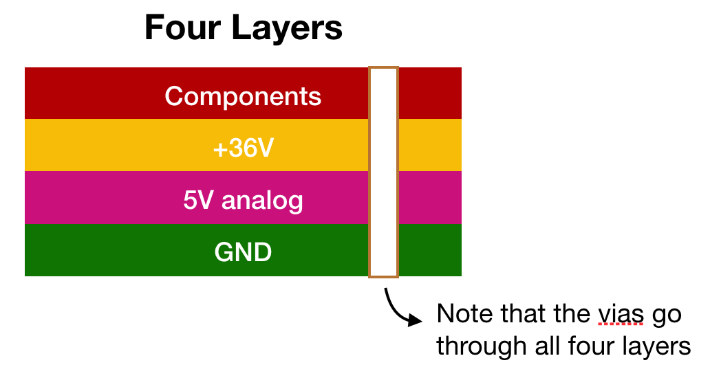

### Powerboard Activity 

#### Step X: Assign footprints
* Resistors: Resistor_SMD:R_0805_2012MetricPad1.15x1.40mm_HandSolder
* Capacitors: 

#### Step X: Create a .kicad_pcb file to layout the board 

* Open up the project file (.pro) and select the "PCB Layout Editor" button. KiCAD will ask you to confirm that you want to create a new .kicad_pcb file.

#### Step X: Change the board to be a **four layer** board. 

This power board will be composed of four layers in the following order:

By convention, when referring to the number of layers in a PCB, we refer to the number of copper layers. 
* Go to "File" -> "Board Setup" 
* Set the number of "Copper Layers" to 4, as shown below. Notice that In1.Cu and In2.Cu (short for "Inner Layer") are added to the list of layers.  
* Set In1.Cu (our +36V layer) and B.Cu (our GND layer) to be a "power plane", as shown below. 

#### Step X: Add the board outline 
Import the [provided board outline](https://github.com/lab64makerspace/intro2PCBdesign/blob/master/Overview%20%26%20Details/Powerboard/Powerboard_Activity/Power_board_outline.dxf).

#### Step X: Layout the footprints 
Unlike the LED board, where are component placement was constrained by mechanical requirements, the power board allows for a lot more flexibility. Here are some suggestions to help guide you.

Here is a suggested floorplan. These groups correspond to the labeled clusters of symbols on your schematic. Note that the groups in black text are relatively fixed: we want the barrel jack connector near the bottom of the power board and the LED 5V supplies near their respective sides.

**General tips**

* Try to place components to minimize trace lengths within groups. It might be helpful to rotate footprints: you can do this by clicking on the footprint and hitting "R".
* Remember that we have +36V and GND layers, so we can use vias to free up placement constraints. 
* Within each group, we suggest placing the voltage regulator first, as many other components will connect to it.
* When placing the terminal blocks, note that the larger part of the footprint is where the external wires will connect, so they should face outward.

We know this is a daunting step, so please reach out to us if you have questions or if you'd like us to look over your layout!

#### Step X: Add thermal vias 

#### Step X: Make the power planes 

