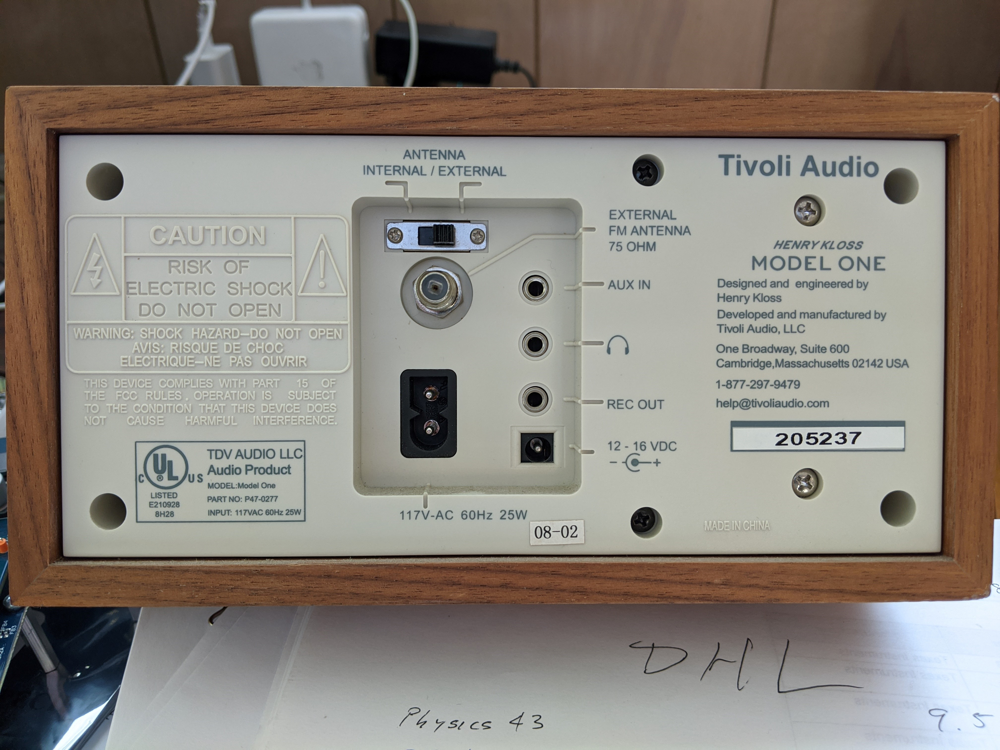
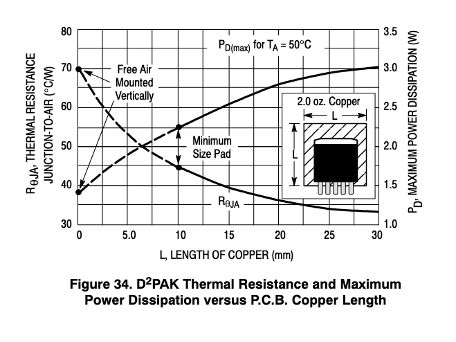

Hey!

### So the first step is to determine the three things that we always determine:
- mechanical outline
- electrical functionality
- design rules / fab considerations
### MECHANICAL OUTLINE
For the power board, the mechanical outline is easy - it forms the back panel of the UberRadio enclosure, so that function determines the "lateral" mechanical envelope. There is no reason for the board to be some odd thickness; 1.6 mm (0.062") is a good standard choice. If we need to stiffen it to enhance the acoustic properties or enhance the feel of the connector insertion or whatever, that is easily done by providing locations for stiffening ribs that can be attached in final assembly.

Here's an image of the Model One back panel so you have an idea of what they did...

This means that the board mechanical dimensions are 120.65 mm x 198 mm x 1.6 mm.

### ELECTRICAL FUNCTIONALITY
Now we need to determine the electrical functionality. In addition to functioning as the back panel, the power board should be designed to, that's right, provide power! We had decided that the input power would be derived from the mains by the use of an AC/ DC power adapter. This decision was driven by the desire to have an efficient, external supply so we
1.	don't waste power
2.	meet FCC requirements
3.	don't have any shock hazard
4.	have a cost effective solution
We selected a 36V 66W AC/DC External Wall Mount (Class II) Adapter Multi-Blade (Included) Input manufactured by Tri-Mag LLC (their P/N ICM30-360). How in the world did we know this was a reasonable choice?

To explain this we need to find out how much power the entire UberRadio will use, because we know that all the power needed will come from this input. So how do we find this? We can make a list of the power required for each board.

The calculations go like this:
-	Left LED Board -  There are 48 APA102-2020 LEDs. Each one can draw a maximum of 60mA @ +5VDC, so 48 x 60mA = 2.88A @ 5VDC --> Let's count that as 3A @ 5VDC (15VAs for those following along).
-	Right LED Board - Well we just did that, since they are identical. So that's another 3A @ 5VDC (15VAs).
-	Display Board - Here's my guess... 300mA @ +5VDC Please let me know if you think I'm correct and why. (That's 1.5 VAs!)
-	SAM32 - +5VDC @ 0.5A (2.5 VAs)
-	Audio Board - Several different voltages required: +36VDC @ 3.5A (126VAs), +15VDC @ 0.5A (7.5 VAs), +5VDC @ 0.5A (2.5VAs), -5VDC @ 0.2A (1.0VA)
 
But here's the thing... Poor Mr. Speaker is rated at 8 Ohms and maximum dissipation of 30 Watts! So the Class D audio amp is going to turn the speaker into a projectile if we aren't careful!! So that 126 VAs (or Watts if it is real) is 4X too much! Why would we do that? Well, if we look at the various amp configurations and the THD and efficiency ratings, we are able to run in a sweet spot on this. So we'll only actually draw 0.875 A from the +36 VDC even when we're bumpin' some jams.

BUT for folks that want to light stuff on fire - if we design this right, they can just get a more expensive AC/DC Adapter and blow stuff up. Same input jack and everything!

These are all MAXIMUM power draw ratings... So clearly the little 66W (66VA) supply will be "challenged". But probably not unduly so... It'll sound pretty great, I think, so let's finish this up!

POWER BOARD INPUT +36VDC @ 1.66A (or ~ 4A for LOUD folks) from 2.1mm I.D. x 5.5 mm O.D. plug (11 or 12 mm long I suspect).
We'll take this +36VDC and turn it into :
Section I --> +36VDC for the Audio Board (no fussing here)
Section II --> +5VDC @ 3A for the Left LED Board
Section III --> +5VDC @ 3A for the Right LED Board
Section IV --> +5VDC @ 1.5A for the SAM32, Display Board, and Audio Board
Section V --> +15VDC @ 0.5A for the Audio Board
Section VI --> -5VDC @ 0.3A for the Audio Board

I've broken these into regulator sections since we want the boards that draw more power to be well regulated and NOT influence the other boards.

So it should be clear what we're looking for in each of these sections and how the design should evolve.

### DESIGN RULES / FAB CONSIDERATIONS
This board should not end up being very dense. We have an entire back panel and only a few pretty straightforward regulators sections to put on it. In addition, the currents, while significant, aren't SUPER large, so we should be able to use a couple 1oz. layers in parallel to provide some good lower resistance paths. Please note that we're talking resistance here, not impedance, since the entire purpose is to provide DC power.
For this board we'll want to pay attention to the thermal characteristics of the regulator sections and use the board surface exposed to air in the rear as a way to dissipate heat to the ambient air. There is no plan for a fan; we're talking natural convection on this one!
If we decide to be picky, perhaps we can find things that are almost all SMT so we don't have things sticking out the rear surface. This would be attractive because, well it would give a clean attractive appearance, and there will be no sharp bits to cut folks, and this would mean that there are no bits to work as antennas. Some of you must be asking, "But how will the WiFi and Bluetooth do their job if we have all this copper on the back and on the LED boards? Won't this shield the heck out of those?" Well, that's why we're going to make the top, bottom, and front panel out of something dielectric and hope that'll do. So it looks lie we can use some very standard design rules here along with a four layer board so we get some internal planes to use. If we're lucky, we can try to jam all the stuff in one part of the board and clear the rest so it's electrically transparent. So we're at a four layer, 10/10 nothing special 1 oz. finished plating FR4 PCB. YAY!

So with all this explained, it looks like the design should be a slam-dunk! You should have a go at it! See what happens.

Here are some candidates -

+5V @ 3A --> ADP2303ARDZ-5.0-R7 

+5V @ 1.8A --> IFX91041EJV50XUMA1 

+15V @ 1A --> LM2575D2T-15R4G             Check this out for the LM2575 D2PAK couldn't get much clearer, huh!
 

-5VDC @ 275mA --> MAX735CSA+

Please let me know if you have any questions. And HAVE FUN!!

I'll finish the design tomorrow. If you're interested, I can share it with you. But if you're already done, I'll be happy to check your design.

All the best
 - Steve
