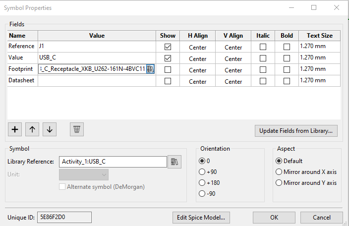
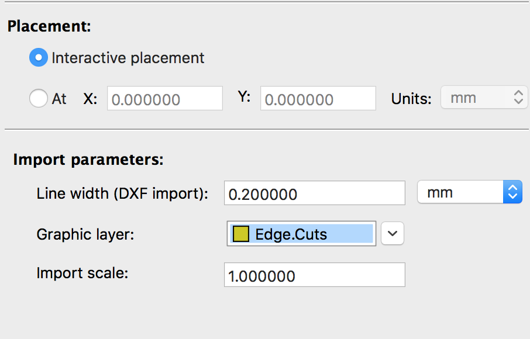
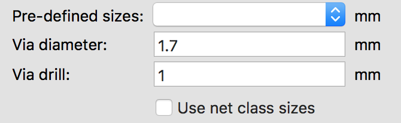
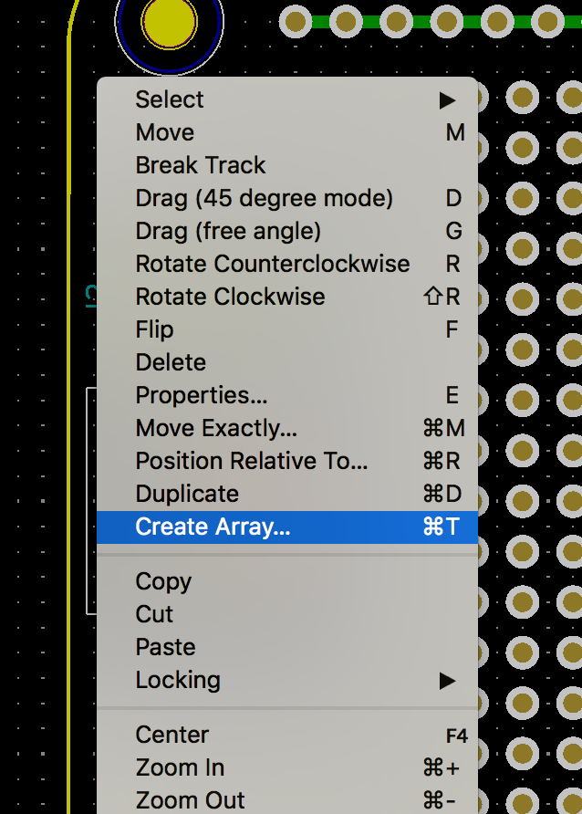
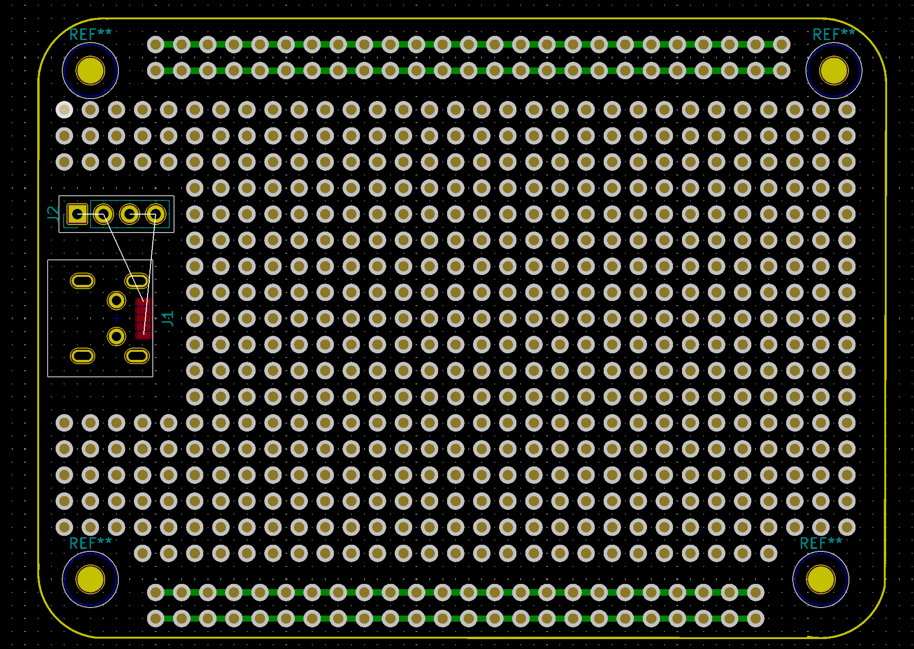

# ACTIVITY #1 - Build a modern "1/2 sized" proto board
### USB 2.0 Version

You will learn to and demonstrate that you can:
1. create a board outline
2. place a connector
3. place mounting holes
4. export the board to a CAD program
5. assess fit
6. re-position components to achieve mechanical clearance / fit
7. generate the required fabrication files
8. submit the design for DFM
9. order the board

**EXTRA CREDIT:**
You can make a simple board that has a more complicated outline and have that fabricated instead (maybe a holiday related thing? snowman, snowflake, Xmas tree, ornament, Halloween gizmo, etc.). It MUST still have a USB connector for power but attachment points may be substituted for mounting holes.

## Introduction - 

In the course of building things one may not want to wait for a printed circuit board to be fabricated. Often results can be obtained more quickly by "prototyping" a circuit. This is particularly true if the circuit is simple and only one is required. There are many different small prototyping PCBs available commercially that are suitable for this sort of application. Among these is the so-called "1/2 sized" breadboard. These tend to be about 60 mm (~ 2.375") by 80 mm (~ 3.25") by 1.6 mm (~ 1/16") thick. They have an array of holes into which one can place components for soldering. The "back" side of the board is used for point to point wiring. If one so chooses, sockets and wire-wrapping techniques may be employed so that circuitry can be built up in sections and can be re-wired as the need arises.

Although these are super cool, for some projects they can be very difficult to use. For example, if you want to build a USB powered thing, it is difficult to place USB connectors on the board since no provision has been made for that. Also, this size protoboard usually has two centrally located mounting holes; great if you want to work on a tippy gizmo!

**SO**, you are going to fix these deficiencies by creating your OWN "1/2" sized protoboard!!

Let's look at a couple of existing "1/2 sized" protoboards...  

What do you notice?

*********************
Discussion....
* 0.100" hole centers
* 0.300" center spacing
* "Rails"
* Soldermask
* Pad shape
* Hole size
* Other things...
********************

## Instructions 
#### 1) Open a CAD program  
Choose your favorite **C**omputer **A**ided **D**esign tool. If you don't have one, consider: [Solidworks](https://library.stanford.edu/englib/using-terman/computers-equipment-software/solidworks), [Onshape](https://www.onshape.com/education-plan), or [Inkscape](https://inkscape.org/release/inkscape-0.92.4/). Make a sketch of a board outline (a 60 mm x 80 mm rectangle). Fillet the corners of the sketch. Export the sketch as a DXF. You can find more detailed instructions on how to do this on [this page](../../../Protoboard/Protoboard_Activity/Board_Outline_Instructions.md). You may use our sample DXF file found [here](./) if you wish. If you want to learn how to use a *custom* board outline then check out [this guide](../custom-board-outline-guide.md).

**Why use a CAD program to make a board outline?**
We encourage you to make your board outline in a CAD program instead of directly in KiCAD because CAD programs make it easier for you to dimension your sketch geometry and define curves. This also helps you avoid the constraints imposed by KiCAD's grid that makes it challenging to define more complex shapes that don't snap to grid points. Additionally, working with a CAD program allows you to design your outline with reference to the CAD models of other parts of your system (e.g. the box your board may sit in) to ensure proper mechanical integration of all your hardware. 

#### 2) Open the Activity 1 Schematic  
Open Activity_1.pro in KiCad (found [here](Activity_1.pro)).
Then select Activity_1.sch from the project.

#### 3) Add the following connections  
D+ -- no connect  
D- -- no connect  
ID -- no connect  
GND -- connect to GNDREF  
Shield -- connect to GNDREF  
VBUS -- connect to pins 1 and 2 of the connector  
Connect pins 3 and 4 of the connector to GNDREF  

To add a “no connect”, select the cross symbol (“Place no connection flag”) in the toolbar on the right.

(It is also nice to add a little "n/c" designation, too. It helps when you're zoomed out!)

To add a wire, press W.

To move a wire, hover over the wire and press G.

#### 4) Annotate the schematic. 
Go to Tools -- Annotate Schematic Symbols. This will give all lines and components names.  
Add a “+5” label to the wire connected to VBUS. Hover over the wire, and press L to add this label. You can later edit the label by hovering over the label and pressing E. Any wires with the same labels are considered by the program to be electrically connected. Note that labels are case sensitive. 

#### 5) Download the USB connector footprint 
Download the following [file](./USB2_MINI/USB_Mini_B_Female_UX60-MB-5S8.kicad_mod) to get the correct USB connector footprint. 

Open the footprint editor in the Pcbnew software.  

Go to File -- Import Footprint from KiCad File...  
Select the file you downloaded (USB_Mini_B_Female_UX60-MB-5S8.kicad_mod). It should now appear in your footprint library.  

If this doesn't work for you, you can also import the footprint by selecting "Preferences - Manage Footprint Libraries" and select the "plus" button to add the connector. 

#### 6) Link the footprints to the symbols 
Symbols are the components on schematics, while footprints are where components get placed onto the board. At this time, the footprint and schematic are still not linked.  
Hover over the USB connector and press E to get access to symbol properties. Select the button (shaped liked library books) on the far right of the footprint field to open up the footprint library.  
 
Select “USB_Mini_B_Female_UX60-MB-5S8” as shown below. 

Repeat this process for the pin header connector. For this component, select “PinHeader_1x04_P2.54mm_Vertical”. Note that in the footprint of this connector, pin 1 is square. This is useful to avoid getting confused when orienting the connector.  

Repeat this process for the mounting holes. For these components, select "MountingHole_2.5mm". 

#### 7) Modify the USB connector footprint
Open the footprint editor.   
Select the “USB_Mini_B_Female_UX60-MB-5S8” and right click on it. Select "Edit Footprint." Hover over the holes labeled "SH" and press E. Change the "SH" label to "6."  

#### 8) Add the board outline 
Open the project .kicad_pcb file. One way this can be done is by clicking on the button shown below. 

Go to File -- Import -- Import graphics 

Select your DXF and the following parameters.  

#### 9) Add vias to the board 

Add a via by selecting the add via button.  

Change the via properties (hover over the via and press E) to the following diameter and drill sizes: 

Create an array from this via by right clicking on the via and select "Create Array". Note that the standard distance between vias is 2.54mm.    

Here is what a sample board might look like now.  

#### 10) Add routes 
Add route tracks by clicking the following button.  

Hover over the route and press E to change the route properties. Set the track width to 0.635mm and select whether you want the track to be on the top (red) or bottom (green) of the board. 

Add routes to the USB connector as follows. Note that you must place the routes on top of the board in order to make an electrical connection with the USB connector. If you place the routes properly, the white x's will disappear.  

Add routes to the power rail lines (if you want to add power rail lines).  

#### 11) Generate Gerber Files 
Select File -- Plot   
Select an appropriate Output directory Folder.  
Select "Run DRC." Make sure your board passes this test by having 0 problems.  
**Make sure you have the "Do not tent vias" option checked!!!**  
Select "Plot" to generate the gerber files.   
Select "Generate Drill Files" to generate the drill files.   
Locate these newly generated files on your computer, and open them with Gerbview to check that everything looks good. 
You're done with the protoboard activity!

#### 12) Submit your files so we can order your board!
Once you've generated gerber files, zip your files and upload your board files to our workshop [google drive](https://drive.google.com/open?id=13aihW4muVBcD2FowuLPLqWqLCCmaQ_uM) and include a text file with your name and the address you'd like us to send it to.

-------------------------------------
*Although we have given you the dimensions for your board, it's important to think about how your board fits into the device you're making and to make modifications accordingly. Here is a brief overview of what that process might look like:*  

OK, so now what is our approach?

Let's think about this!!

Hmmm... we need a board outline. How will we generate this? How will we get it from one
program into another? Do we need to worry about the position during import?

What about the mounting holes? How will we make those?

Gee, putting all those holes in looks like a real pain. How should we do that?

So far, so good, but what about the USB connector?

OK, great!! I think I've got this!!

Now we do the "board layout". Good job!!

Time to make sure it fits in the box.

Let's check out boxes at Hammond Manufacturing. [https://www.hammfg.com/electronics/small-case].

Ooooo... Look at the selection!  Hmmm... We want something that isn't too big... Mounting flanges would be great!... Flame retardant, check! This one looks about right! Let's check out 1591MFLGY by downloading the model from the site [https://www.hammfg.com/electronics/small-case/plastic/1591]

Uh, oh! That USB connector needs to move. How do we do that?

OK, Looking good! Let's generate the artwork and send it out for DFM.

Remember to check the artwork!! OH, NO, I need to find a viewer...

It looks pretty good, let's check to see if it passes DFM.

It does!! Yay!!

OK, let's place the order.

Wow! That was super cool! I can't wait to see it and solder things up.
