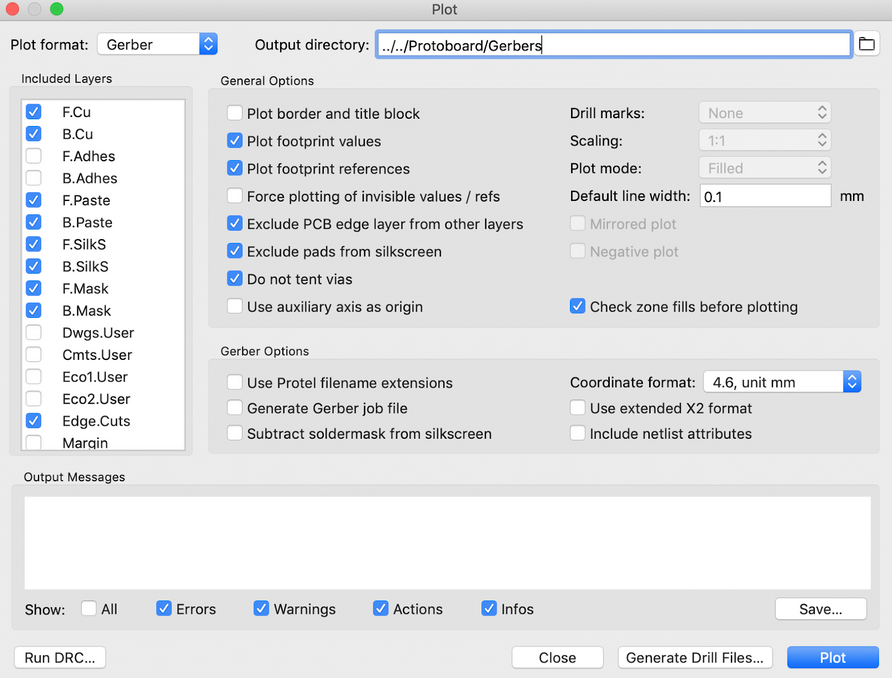
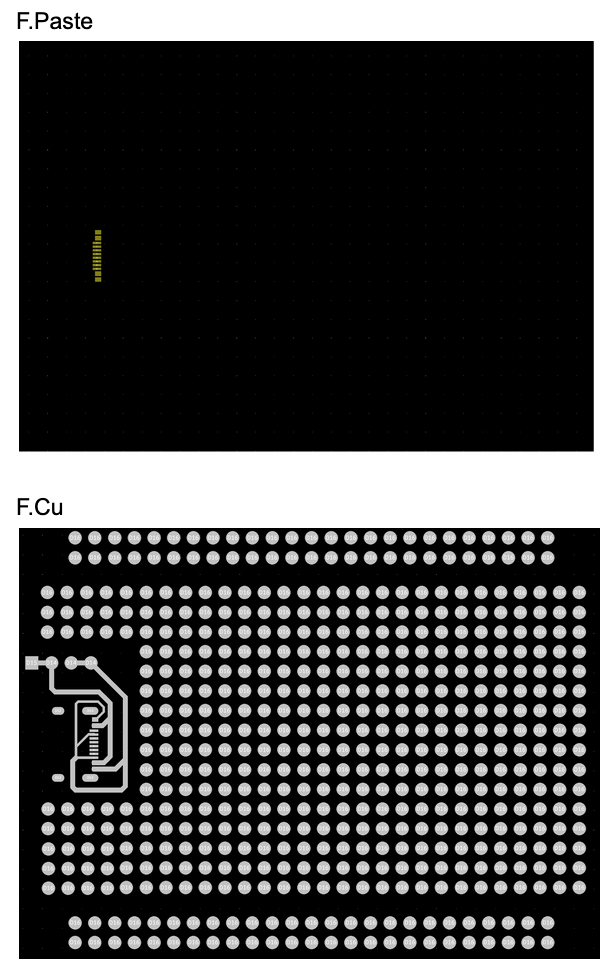
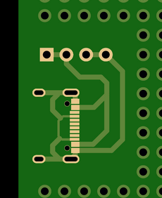

### Instructions on submitting your protoboard for manufacturing 
Select File -- Plot

Select an appropriate Output directory Folder.

Select "Run DRC." Make sure your board passes this test by having 0 problems.

Select "Plot" to generate the gerber files.

Layers you should have checked (For boards with more than 2 copper layers you must include more layers!):
* F.Cu
* B.Cu
* F.Paste 
* B.Paste
* F.SilkS 
* B.SilkS
* F.Mask 
* B.Mask
* Edge.Cuts

Select "Generate Drill Files" to generate the drill files.
Check “Do not tent vias” if you want to be able to solder onto your vias. Uncheck this option if you want your vias to be covered by a solder mask, making them non solderable but protected.
Locate these newly generated files on your computer, and open them with Gerbview to check that everything looks good. Here is approximately what your layers should look like. Note that the Mask layers are negatives: the filled in areas are where soldermask will not be present. All other layers are positives. If you have any questions, please reach out to us.

Lastly, upload your zipped Gerber files to [JLCPCB](https://cart.jlcpcb.com/quote) for a final sanity check. With all the layers checked, you should see something like this. Notice how the copper around the vias are exposed, whereas the copper of the traces is covered with soldermask (thus looks faded).
Please include a screenshot of what you see on JLCPCB in your drive folder. We will not order your board unless you provide this screenshot as confirmation that you’ve checked your board in JLCPCB. 

This board below is not correct. See how the 4-pin connector via copper is exposed, whereas the protoboard vias are still covered in soldermask.
 

Once you've generated gerber files, zip your files and upload your board files to our workshop [google drive](https://drive.google.com/open?id=13aihW4muVBcD2FowuLPLqWqLCCmaQ_uM) and include a text file with your name and the address you'd like us to send it to.

You're done with the protoboard activity!

