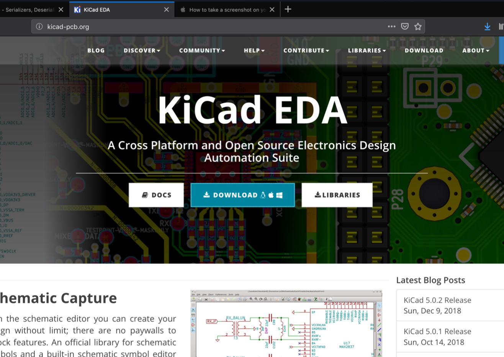
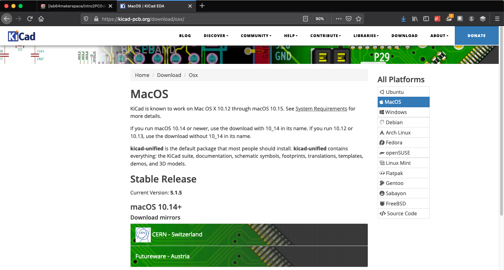

## Install KiCad

Open a browser window and navigate to kicad-pcb.org It should look like this –

Click on the Download button in the center. This will take you to the download page. It will look like this –

Select your operating system by clicking in the appropriate area. If you are using Windows the page will look like this –

! [KiCad_2](../images/KiCad_2.png?raw=true)

If you are using macOS the page will look like this –

In any case, click on the link for the **Nightly Development Builds** and follow the installation instructions.

Verify that your installation was successful by trying to open one of our past PCB projects, [a snowflake PCB](https://github.com/maholli/snowflake/tree/master/snowflake_1). (Open the .pro file). 

