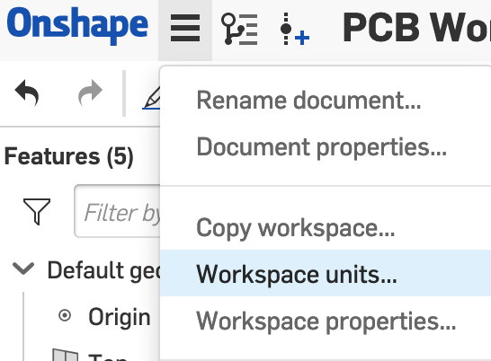
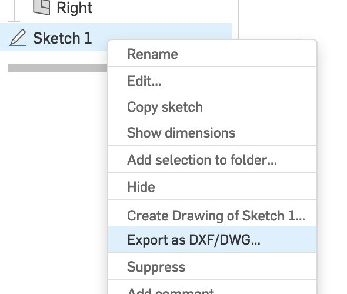
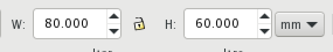

## Option 1: Create a board outline in Onshape
Create a new document in onshape. 

Change the units of the document to mm by going to menu shown below. 

Create a new sketch (select any sketch plane). Press "n" to view normal to the sketch plane. 

Draw a rectangle. Either select the rectangle tool in the upper toolbar or press "g".

Dimension the edges of the rectangle. Press "d" and select the line you want to dimension. Set the length to 80 mm and width to 60mm. 

While still in the same sketch, fillet the edges of the rectangle. Either select the fillet tool from the upper toolbar or press "Shift-F". Then select the four edges of the rectangle and press return. Enter the desired radius for your fillet.

Exit out of the sketch by clicking the green checkmark. 

Export your drawing as a dxf by either :

1. right-clicking anywhere inside the sketch boundaries and selecting "Export as DXF/DWG..., or

1. right-clicking on your sketch in the side bar and select "Export as DXF/DWG..."

## Option 2: Create a board outline in Inkscape 

Open Inkscape. 

Draw a rectangle using the tool shown below. 

Open the "Fill and Stroke" menu if it is not already open. Go to Object -> Fill and Stroke... 
With the rectangle selected, adjust the following properties: 
* Fill tab: select no fill 
* Stroke paint: set to solid flat color (the color does not matter) 
* Stroke style: the line thickness should be non zero but otherwise does not matter

Define the dimensions of the rectangle by selecting the rectangle and modifying the following values. Make sure the units are set to mm. 

First select the rectangle, then round the edges of the rectangle by selecting the "Edit paths by nodes" tool, as shown below. 

The top right corner of the rectangle should be a circle. Drag the circle until the edges of the rectangle are rounded the way you want. 

Convert the object you have created into a path. Select the rectangle, then go to Path -> Object to path. Nothing will seem to have happened, but this is important for the rounded edges to appear in KiCAD. 

Save your design as a dxf. Go to File -> Save as and select the DXF file type. The following options will succesfully get your outline into KiCAD, but feel free to explore the proposed options. 

